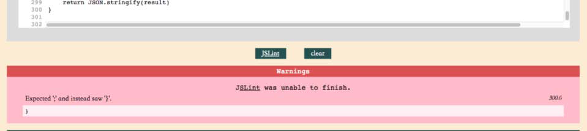
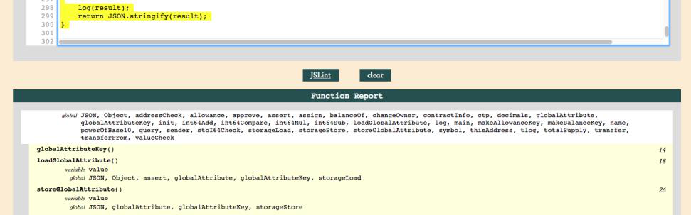
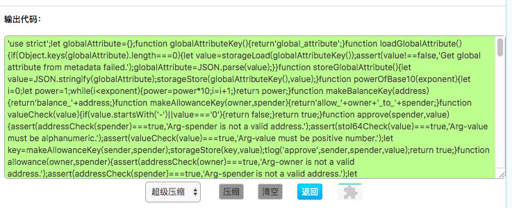
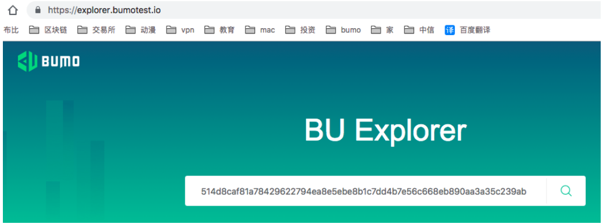
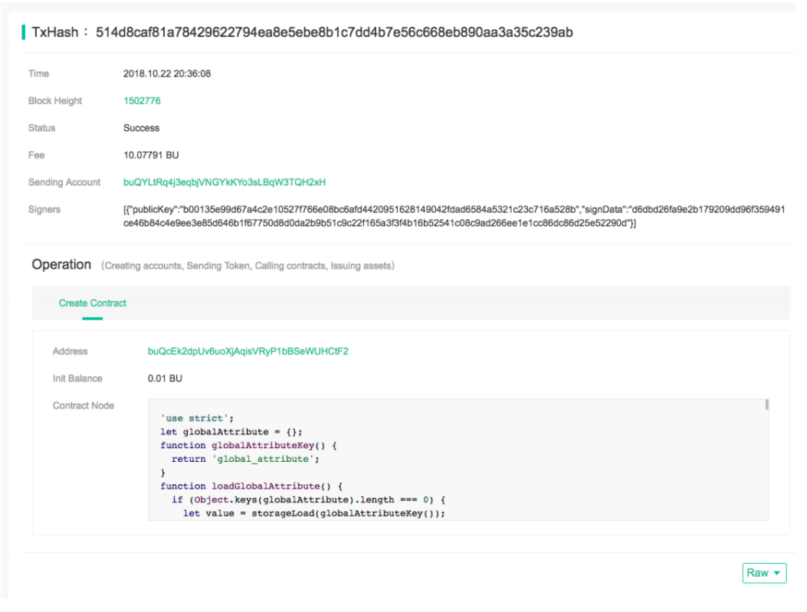
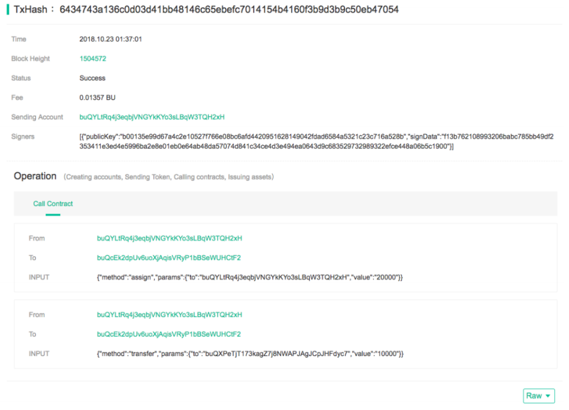

BUMO Smart Contract Development Guide
=====================================

This document mainly introduces the development of smart contracts, including `Contract Definition`_, `Syntax Description`_ of smart contracts, system `Built-in Functions`_, `Built-in Variables`_, `Exception Handling`_, and `Examples`_.

Contract Definition
-------------------

A contract is a code snippet written in ``JavaScript``. The initialization function of the contract is ``init``, and the entry functions executed are ``main`` and ``query``, where the definitions of ``init`` and ``main`` are required. The entry parameter **input** of the above functions is a string, which needs to be specified when you call the contract.

.. code:: javascript
 
   "use strict"; 
   function init(input) 
   { 
     /* init whatever you want */ return;
   }

   function main(input) 
   { 
    /* do whatever you want */ return; 
   }

   function query(input) 
   { 
     /* query whatever you want, but should return what you query */ return input; 
   }

Syntax Description
------------------ 

BUMO smart contracts are written in ``JavaScript``. In order to facilitate developers to develop contracts in a standard and safe way, JSLint is used for detecting contract syntax. For details, please refer to `ContractRules.md <https://github.com/bumoproject/bumo/blob/master/src/web/jslint/ContractRules.md>`_.

Syntax Rules
^^^^^^^^^^^^^

The syntax rules in the smart contract include the following:

- Strict detection of the statement, which means all source code must start with the **"use strict";** field.
- Try to use **let** to declare variables within the statement block.
- Use **===** instead of **==** to judge the comparison; use **!==** instead of **!=** to compare.
- The statement must end with **;**.
- Statement blocks must be enclosed in **{}** and empty statement blocks are not allowed.
- The loop variables and initial variables of **for** need to be declared before the conditional statement block and reassigned each time they are used.
- It is forbidden to use **++** and **--** but you can use **+=** and **-=**.
- The **eval**, **void**, **this** keywords are prohibited.
- It is forbidden to use **new** to create **Number**, **String**, **Boolean** objects, but you can get objects by calling their constructors.
- It is forbidden to create an array with the following array keywords:

::

 "Array", "ArrayBuffer", "Float32Array", "Float64Array", "Int8Array", "Int16Array", "Int32Array", "Uint8Array", "Uint8ClampedArray", "Uint16Array", "Uint32Array"
 let color = new Array(100); //Compilation error 
 
 
 //You can use the following statement to replace the new Array (100) statement;
 let color = ["red","black"]; 
 let arr = [1,2,3,4];

- It is forbidden to use the **try** and **catch** keywords, but you can use **throw** to manually throw an exception.
- The following keywords are prohibited:

::

 "DataView", "decodeURI", "decodeURIComponent", "encodeURI", "encodeURIComponent", "Generator","GeneratorFunction", 
 "Intl", "Promise", "Proxy", "Reflect", "System", "URIError", "WeakMap", "WeakSet", "Math", "Date"

Detection Tools
^^^^^^^^^^^^^^^

Detection tools are divided into local detection tools and online detection tools.

If you use the local detection tool, you can click `jslint <https://github.com/bumoproject/bumo/tree/master/src/web/jslint>`_ and download the index.html under the directory.

If you use the online detection tool, you can click `jslint.html <http://bumo.chinacloudapp.cn:36002/jslint.html>`_.

Text Compression Tools
^^^^^^^^^^^^^^^^^^^^^^

Text compression tools are divided into local compression tools and online compression tools.

If you use the local compression tool, you can download `jsmin <https://github.com/bumoproject/bumo/tree/master/deploy/jsmin>`_.

If you use the online compression tool, you can click `jsmin.html <https://jsmin.51240.com>`_.

Built-in Functions
------------------

The system provides some global functions to help you to obtain information about the blockchain, or to drive the account to initiate all transactions (except for setting thresholds and weights).

.. note:: Custom functions and variables should not be duplicated with global functions and built-in variables, otherwise uncontrollable data errors will result.

For details, please refer to `contract <https://github.com/bumoproject/bumo/blob/master/docs/develop_CN.md#合约>`_.

Read and Write Permission of Functions
^^^^^^^^^^^^^^^^^^^^^^^^^^^^^^^^^^^^^^

Each function has a fixed read-only or write permission.
Read-only permission means that data is not written to the blockchain, such as the ``getBalance`` function used to get the balance has read-only permission.
Write permission means that data will be written to the blockchain, such as the ``payCoin`` function used to transfer coins has write permission.
Different entry functions have different calling permissions when you write smart contracts. The ``init`` and ``main`` functions can call all built-in functions but the ``query`` function can only call functions with read-only permission, otherwise you will be prompted that the interface is not defined during debugging or execution.

Introduction to Return Value
^^^^^^^^^^^^^^^^^^^^^^^^^^^^

For any internal function call, ``false`` will be returned if it fails, or an exception is thrown to terminate the execution.
If a parameter error is encountered, the location of the error parameter is indicated in the error description. The position refers to the index number of the parameter, that is, counting from 0.
For example, parameter 1 indicates the second parameter is incorrect. Please refer to the following example:

::
 
 issueAsset("CNY", 10000); /* Error description：Contract execute error, issueAsset parameter 1 should be a string */

Function Details
^^^^^^^^^^^^^^^^

This section focuses on some of the functions involved in the smart contract development process, including ``getBalance``, ``storageStore``, ``storageLoad``, ``storageDel``, ``getAccountAsset``,
``getBlockHash``, ``addressCheck``, ``stoI64Check``, ``int64Add``, ``int64Sub``,
``int64Mul``, ``int64Div``, ``int64Mod``, ``int64Compare``, ``toBaseUnit``, ``log``,
``tlog``, ``issueAsset``, ``payAsset``, ``payCoin``, and ``assert``.

getBalance
~~~~~~~~~~~

**Function Description**

The ``getBalance`` function is used to get account information (metadata and asset information excluded).

**Function Call**

::

 getBalance(address);

**Parameter Description**

``address``: the account address.

**Example**

.. code:: javascript

 let balance = getBalance('buQsZNDpqHJZ4g5hz47CqVMk5154w1bHKsHY'); 
 
 /* Permission: read-only
    Return value: numbers in string format '9999111100000' */

storageStore
~~~~~~~~~~~~

**Function Description**

The ``storageStore`` function is used to store the metadata of the contract account.

**Function Call**

::

 storageStore(metadata_key, metadata_value);

**Parameter Description**

``metadata_key``: the key of metadata.

``metadata_value``：the value of metadata.

**Example**

.. code:: javascript

 storageStore('abc', 'values'); 
 /* Permission: write 
    Return value: return true if it succeeds; throw an exception it fails. */

storageLoad
~~~~~~~~~~~~

**Function Description**

The ``storageLoad`` function is used to get the metadata of the contract account.

**Function Call**

::
 
 storageLoad(metadata_key);

**Parameter Description**

``metadata_key``：the key of metadata.

**Example**

.. code:: javascript
 
 let value = storageLoad('abc'); 
 /* Permission: read-only 
    Return value: return a string such as 'values' if it succeeds; return false if it fails. 
    This example gets the value of 'abc' for custom data in the contract account.*/

storageDel
~~~~~~~~~~~

**Function Description**

The ``storageDel`` function is used to delete the metadata of the contract account.

**Function Call**

::

 storageDel(metadata_key);

**Parameter Description**

``metadata_key``: the key of metadata.

**Example**

.. code:: javascript

 storageDel('abc');
 /*
  Permission: write
  Return value: return true if it succeeds; throw an exception if it fails.
  This example deletes the value of abc for custom data in this contract account*/

getAccountAsset
~~~~~~~~~~~~~~~~

**Function Description**

The ``getAccountAsset`` function is used to get the asset information of an account.

**Function Call**

::

 getAccountAsset(account_address, asset_key);

**Parameter Description**

``account_address``: the account address.

``asset_key``: the attributes of the asset.

**Example**

.. code:: javascript

 let asset_key =
 {
 'issuer' : 'buQsZNDpqHJZ4g5hz47CqVMk5154w1bHKsHY',
 'code' : 'CNY'
 };
 let bar = getAccountAsset('buQsZNDpqHJZ4g5hz47CqVMk5154w1bHKsHY', 
 asset_key);
 /*
 Permission: read-only
 Return value: return digital asset such as '10000' if it succeeds; return false if it fails.
 */

getBlockHash
~~~~~~~~~~~~~

**Function Description**

The ``getBlockHash`` function is used to get the block information.

**Function Call**

::

 getBlockHash(offset_seq);

**Parameter Description**

``offset_seq``: the offset from the last block, the maximum of which can be up to 1024.

**Example**

.. code:: javascript

 let ledger = getBlockHash(4);
 /*
 Permission: read-only
 Return value: return a string such as 
 'c2f6892eb934d56076a49f8b01aeb3f635df3d51aaed04ca521da3494451afb3' if it succeeds;
 return false if it fails.
 */

addressCheck
~~~~~~~~~~~~~

**Function Description**

The ``addressCheck`` function is used for address legality checking.

**Function Call**

::
 
 addressCheck(address);

**Parameter Description**

``address``: the address parameter, which is a string.

**Example**

.. code:: javascript

 let ret = addressCheck('buQgmhhxLwhdUvcWijzxumUHaNqZtJpWvNsf');
 /*
 Permission: read-only
 Return value: return true if it succeeds; return false if it fails.
 */

stoI64Check
~~~~~~~~~~~~

**Function Description**

The ``stoI64Check`` function is used for validity checking of numeric strings.

**Function Call**

::

 stoI64Check(strNumber);

**Parameter Description**

``strNumber``: the umeric argument in string format.

**Example**

.. code:: javascript

 let ret = stoI64Check('12345678912345');
 /*
 Permission: read-only
 Return value: return true if it succeeds; return false if it fails.
 */

int64Add
~~~~~~~~~~

**Function Description**

The ``int64Add`` function is used for 64-bit addition.

**Function Call**

::

 int64Add(left_value, right_value);

**Parameter Description**

left_value：the left value.

right_value：the right value.

**Example**

.. code:: javascript

 let ret = int64Add('12345678912345', 1);
 /*
 Permission: read-only
 Return value: return a string '12345678912346' if it succeeds; throw an exception if it fails.
 */

int64Sub
~~~~~~~~~

**Function Description**

The ``int64Sub`` function is used for 64-bit subtraction.

**Function Call**

::

 int64Sub(left_value, right_value);

**Parameter Description**

``left_value``：the left value.

``right_value``：the right value.

**Example**

.. code:: javascript

 let ret = int64Sub('12345678912345', 1);
 /*
 Permission: read-only
 Return value: return a string '123456789123464' if it succeeds; throw an exception if it fails.
 */

int64Mul
~~~~~~~~~~

**Function Description**

The ``int64Mul`` function is used for 64-bit multiplication.

**Function Call**

::

 int64Mul(left_value, right_value);

**Parameter Description**

``left_value``：the left value.

``right_value``：the right value.

**Example**

.. code:: javascript

 let ret = int64Mul('12345678912345', 2);
 /*
 Permission: read-only
 Return: return a string '24691357824690' if it succeeds; thrown an exception if it fails.
 */

int64Div
~~~~~~~~~~

**Function Description**

The ``int64Div`` function is used for 64-bit division.

**Function Call**

::

 int64Div(left_value, right_value);

**Parameter Description**

``left_value``：the left value.

``right_value``：the right value.

**Example**

.. code:: javascript

 let ret = int64Div('12345678912345', 2);
 /*
 Permission: read-only
 Return value: return '6172839456172' if it succeeds; throw an exception if it fails.
 */

int64Mod
~~~~~~~~~

**Function Description**

The ``int64Mod`` function is used for 64-bit modulo operations.

**Function Call**

::

 int64Mod(left_value, right_value);

**Parameter Description**

``left_value``：the left value.

``right_value``：the right value.

**Example**

.. code:: javascript

 let ret = int64Mod('12345678912345', 2);
 /*
 Permission: read-only
 Return value: return a string '1'; throw an exception if it fails.
 */

int64Compare
~~~~~~~~~~~~~

**Function Description**

The ``int64Compare`` function is used for 64-bit comparison operations.

**Function Call**

::

 int64Compare(left_value, right_value);

**Parameter Description**

``left_value``：the left value.

``right_value``：the right value.

**Example**

.. code:: javascript

 let ret = int64Compare('12345678912345', 2);
 /*
 Permission: read-only
 Return value: return 1 if it succeeds (the left value is greater than the right value); throw an exception if it fails.
 */

.. note:: 
 
 - The return value is 1: the left value is greater than the right value.
 - The return value is 0: the left value is equal to the right value.
 - The return value is -1: the left value is less than the right value.

toBaseUnit
~~~~~~~~~~~

**Function Description**

The ``toBaseUnit`` function is used to transform units.

**Function Call**

::

 toBaseUnit(value);

**Parameter Description**

``value``: the converted number. Only a string can be passed, which can contain decimal places, and at most 8 decimal places can be reserved.

**Example**

.. code:: javascript

 let ret = toBaseUnit('12345678912');
 /*
 Permission: read-only
 Return value: return a string multiplied by 10^8 such as '1234567891200000000'; throw an exception if it fails.
 */

log
~~~~

**Function Description**

The ``log`` function is used to output the log.

**Function Call**

::

 log(info); 

**Parameter Description**

``info``: the log information.

**Example**

.. code:: javascript

 let ret = log('buQsZNDpqHJZ4g5hz47CqVMk5154w1bHKsHY');
 /*
 Permission: read-only
 Return value: return nothing if it succeeds; return false if it fails.
 */

tlog
~~~~~

**Function Description**

The ``tlog`` function is used to output the transaction log. Calling this function will generate a transaction written on the block.

**Function Call**

::

 tlog(topic,args...);

**Parameter Description**

``topic``: the log subject must be a string with a parameter length of (0,128].

``args...``: it can contain up to 5 parameters, which can be string, numeric or boolean, each with a length of (0,1024].

**Example**

.. code:: javascript

 tlog('transfer',sender +' transfer 1000',true);
 /*
 Permission: write
 Return value: return true if it succeeds; throw an exception if it fails.
 */

issueAsset
~~~~~~~~~~~

**Function Description**

The ``issueAsset`` function is used to issue assets.

**Function Call**

::

 issueAsset(code, amount);

**Parameter Description**

``code``: the asset code.

``amount``: the amount to be issued.

**Example**

.. code:: javascript

 issueAsset("CNY", "10000");
 /*
 Permission: write
 Return: return true if it succeeds; throw an exception if it fails. 
 */

payAsset
~~~~~~~~~

**Function Description**

The ``payAsset`` function is used to transfer assets.

**Function Call**

::

 payAsset(address, issuer, code, amount[, input]);

**Parameter Description**

``address``: the target address to transfer the asset.

``issuer``: the issuer of this asset.

``code``: the asset code.

``amount``: the assets amount to be transferred.

``input``: (optional): the contract parameter, which is an empty string by default.

**Example**

.. code:: javascript

 payAsset("buQsZNDpqHJZ4g5hz47CqVMk5154w1bHKsHY", 
 "buQgmhhxLwhdUvcWijzxumUHaNqZtJpWvNsf", "CNY", "10000", "{}");
 /*
 Permission: write
 Return value: return true if it succeeds; throw an exception if it fails. 
 */

payCoin
~~~~~~~~

**Function Description**

The ``payCoin`` function is used to transfer assets.

**Function Call**

::

 payCoin(address, amount[, input]);

**Parameter Description**

``address``: the target address to send BU.

``amount``: the amount of BU to be sent.

``input``: (optional) it is a contract parameter which is an empty string by default.

**Example**

.. code:: javascript

 payCoin("buQsZNDpqHJZ4g5hz47CqVMk5154w1bHKsHY", "10000", "{}");
 /*
 Permission: write
 Return value: return true if it succeeds; throw an exception if it fails. 
 */

assert
~~~~~~~

**Function Description**

The ``assert`` function is used for assertion validation.

**Function Call**

::

 assert(condition[, message]);

**Parameter Description**

``condition``: the assertion variable.

``message``: (optional) throw an exception if it fails.

**Example**

.. code:: javascript

 assert(1===1, "Not valid");
 /*
 Permission: read-only
 Return value: return true if it succeeds; throw an exception if it fails. 
 */

Built-in Variables
------------------

This section introduces some of the built-in variables involved in the smart contract development process, including `thisAddress`_, `thisPayCoinAmount`_, `thisPayAsset`_, `blockNumber`_, `blockTimestamp`_, `sender`_, and `triggerIndex`_.

thisAddress
^^^^^^^^^^^^

**Variable Description**

The value of the global variable **thisAddress** is equal to the address of the contract account.

For example, account x initiates a transaction to call contract Y. In the execution process, the value of thisAddress is the address of contract account Y.

**Sample Code**

.. code:: JavaScript

::

 let bar = thisAddress; /* The value of bar is the account address of contract Y. */

thisPayCoinAmount
^^^^^^^^^^^^^^^^^^^

**Variable Description**

BU Coin for this payment operation.

thisPayAsset
^^^^^^^^^^^^^^

**Variable Description**

The asset of this payment operation, which is an object type.

::

 {"amount": 1000, "key" : {"issuer": "buQsZNDpqHJZ4g5hz47CqVMk5154w1bHKsHY", "code":"CNY"}}.

blockNumber
^^^^^^^^^^^^

**Variable Description**

The current block height.             

blockTimestamp
^^^^^^^^^^^^^^^^

**Variable Description**

The current block timestamp.

sender
^^^^^^^

**Variable Description**

The address of the caller. The value of sender is the account that called this contract.
For example, if an account initiates a transaction in which an operation is to call contract Y (the source_address of the operation is x), then during the execution of contract Y, the value of sender is the address of account x.

**Sample Code**

.. code:: JavaScript

 let bar = sender; /* Then the value of bar is the account address of x. */

triggerIndex
^^^^^^^^^^^^^^

The value of triggerIndex is the sequence number that triggers the operation of this contract. For example, account A initiates a transaction tx0, and the 0th (starts from 0) operation in tx0 is to transfer assets (contract call) to a contract account, then the value of triggerIndex is 0.

**Sample Code**

::

 let bar = triggerIndex; /* Bar is a non-negative integer*/

Exception Handling
------------------

JavaScript Exception
^^^^^^^^^^^^^^^^^^^^^

When an uncaught JavaScript exception occurs in the process of running a contract, it will be handled as follows:

- The execution of this contract fails and all transactions in the contract will not take effect.
- The transaction that triggered this contract was a failure. The error code is 151.

Transaction Execution Failure
^^^^^^^^^^^^^^^^^^^^^^^^^^^^^

Multiple transactions can be executed in a contract. As long as one transaction fails, an exception is thrown, causing the entire transaction to fail.

Examples
--------

This section introduces three Java-based smart contract development scenarios, where scenario 1 and scenario 2 are associated. The scenarios are based on the smart contract code that follows the CTP 1.0 protocol.
The code comes from `contractBasedToken.js <https://github.com/bumoproject/bumo/blob/master/src/ledger/contractBasedToken.js>`_.

.. code:: javascript
 
 /*
 Contract-based token template
 OBSERVING CTP 1.0
 
 STATEMENT:
 Any organizations or individuals that intend to issue contract-based tokens on BuChain should abide by the Contract-based Token Protocol(CTP). Therefore, any contract that 
 created on BuChain including global attributes of CTP, we treat it as contract-based token.
 */

 'use strict';
 let globalAttribute = {};
 function globalAttributeKey(){
 return 'global_attribute';
 }

 function loadGlobalAttribute(){
 if(Object.keys(globalAttribute).length === 0){
 let value = storageLoad(globalAttributeKey());
 assert(value !== false, 'Get global attribute from metadata failed.');
 globalAttribute = JSON.parse(value);
 }
 }

 function storeGlobalAttribute(){
 let value = JSON.stringify(globalAttribute);
 storageStore(globalAttributeKey(), value);
 }

 function powerOfBase10(exponent){
 let i = 0;
 let power = 1;
 while(i < exponent){
 power = power * 10;
 i = i + 1;
 }
 return power;
 }

 function makeBalanceKey(address){
 return 'balance_' + address;
 }
 function makeAllowanceKey(owner, spender){
 return 'allow_' + owner + '_to_' + spender;
 }

 function valueCheck(value) {
 if (value.startsWith('-') || value === '0') {
 return false;
 }
 return true;
 }

 function approve(spender, value){
 assert(addressCheck(spender) === true, 'Arg-spender is not a valid address.');
 assert(stoI64Check(value) === true, 'Arg-value must be alphanumeric.');
 assert(valueCheck(value) === true, 'Arg-value must be positive number.');

 let key = makeAllowanceKey(sender, spender);
 storageStore(key, value);
 tlog('approve', sender, spender, value);
 return true;
 }

 function allowance(owner, spender){
 assert(addressCheck(owner) === true, 'Arg-owner is not a valid address.');
 assert(addressCheck(spender) === true, 'Arg-spender is not a valid address.');
 
 let key = makeAllowanceKey(owner, spender);
 let value = storageLoad(key);
 assert(value !== false, 'Get allowance ' + owner + ' to ' + spender + ' from metadata failed.');

  return value;
 }

 function transfer(to, value){
 assert(addressCheck(to) === true, 'Arg-to is not a valid address.');
 assert(stoI64Check(value) === true, 'Arg-value must be alphanumeric.');
 assert(valueCheck(value)  === true, 'Arg-value must be positive number.');
 if(sender === to) {
 tlog('transfer', sender, to, value); 
 return true;
 }

 let senderKey = makeBalanceKey(sender);
 let senderValue = storageLoad(senderKey);
 assert(senderValue !== false, 'Get balance of ' + sender + ' from metadata failed.');

 assert(int64Compare(senderValue, value) >= 0, 'Balance:' + senderValue + ' of sender:' + sender + ' < transfer value:' + value + '.');

 let toKey = makeBalanceKey(to);
 let toValue = storageLoad(toKey);
 toValue = (toValue === false) ? value : int64Add(toValue, value); 
 storageStore(toKey, toValue);

 senderValue = int64Sub(senderValue, value);
 storageStore(senderKey, senderValue);
 tlog('transfer', sender, to, value);
 return true;
 }

 function assign(to, value){ 
    assert(addressCheck(to) === true, 'Arg-to is not a valid address.'); 
    assert(stoI64Check(value) === true, 'Arg-value must be alphanumeric.'); 
    assert(valueCheck(value) === true, 'Arg-value must be positive number.'); 
     
    if(thisAddress === to) { 
        tlog('assign', to, value); 
        return true; 
        } 
     
    loadGlobalAttribute(); 
    assert(sender === globalAttribute.contractOwner, sender + ' has no permission to assign contract balance.'); 
    assert(int64Compare(globalAttribute.balance, value) >= 0, 'Balance of contract:' + globalAttribute.balance + ' < assign value:' + value + '.'); 
 
    let toKey = makeBalanceKey(to); 
    let toValue = storageLoad(toKey); 
    toValue = (toValue === false) ? value : int64Add(toValue, value);  
    storageStore(toKey, toValue); 
 
    globalAttribute.balance = int64Sub(globalAttribute.balance, value); 
    storeGlobalAttribute(); 
 
    tlog('assign', to, value); 
 
    return true; 
 } 
 function transferFrom(from, to, value){ 
    assert(addressCheck(from) === true, 'Arg-from is not a valid address.'); 
    assert(addressCheck(to) === true, 'Arg-to is not a valid address.'); 
    assert(stoI64Check(value) === true, 'Arg-value must be alphanumeric.'); 
    assert(valueCheck(value) === true, 'Arg-value must be positive number.'); 
     
    if(from === to) { 
        tlog('transferFrom', sender, from, to, value); 
        return true; 
    } 
     
    let fromKey = makeBalanceKey(from); 
    let fromValue = storageLoad(fromKey); 
    assert(fromValue !== false, 'Get value failed, maybe ' + from + ' has no value.'); 
    assert(int64Compare(fromValue, value) >= 0, from + ' balance:' + fromValue + ' < transfer value:' + value + '.'); 
 
    let allowValue = allowance(from, sender); 
    assert(int64Compare(allowValue, value) >= 0, 'Allowance value:' + allowValue + ' < transfer value:' + value + ' from ' + from + ' to ' + to  + '.'); 
 
    let toKey = makeBalanceKey(to); 
    let toValue = storageLoad(toKey); 
    toValue = (toValue === false) ? value : int64Add(toValue, value); 
    storageStore(toKey, toValue); 
 
    fromValue = int64Sub(fromValue, value); 
    storageStore(fromKey, fromValue); 
 
    let allowKey = makeAllowanceKey(from, sender); 
    allowValue   = int64Sub(allowValue, value); 
    storageStore(allowKey, allowValue); 
 
    tlog('transferFrom', sender, from, to, value); 
 
    return true; 
 } 
 
 function changeOwner(address){ 
    assert(addressCheck(address) === true, 'Arg-address is not a valid address.'); 
 
    loadGlobalAttribute(); 
    assert(sender === globalAttribute.contractOwner, sender + ' has no permission to modify contract ownership.'); 
 
    globalAttribute.contractOwner = address; 
    storeGlobalAttribute(); 
 
    tlog('changeOwner', sender, address); 
 } 
 
 function name() { 
    return globalAttribute.name; 
 } 
 
 function symbol(){ 
    return globalAttribute.symbol; 
 } 
 
 function decimals(){ 
    return globalAttribute.decimals; 
 } 
 
 function totalSupply(){ 
    return globalAttribute.totalSupply; 
 } 
 
 function ctp(){ 
 return globalAttribute.ctp; 
 } 
 
 function contractInfo(){ 
    return globalAttribute; 
 } 
 
 function balanceOf(address){ 
    assert(addressCheck(address) === true, 'Arg-address is not a valid address.'); 
 
    if(address === globalAttribute.contractOwner || address === thisAddress){ 
        return globalAttribute.balance; 
    } 
 
    let key = makeBalanceKey(address); 
    let value = storageLoad(key); 
    assert(value !== false, 'Get balance of ' + address + ' from metadata failed.'); 
 
    return value; 
 } 
 
 function init(input_str){ 
    let input = JSON.parse(input_str); 
 
    assert(stoI64Check(input.params.supply) === true && 
           typeof input.params.name === 'string' && 
           typeof input.params.symbol === 'string' && 
           typeof input.params.decimals === 'number', 
           'Args check failed.'); 
 
    globalAttribute.ctp = '1.0'; 
    globalAttribute.name = input.params.name; 
    globalAttribute.symbol = input.params.symbol; 
    globalAttribute.decimals = input.params.decimals; 
    globalAttribute.totalSupply = int64Mul(input.params.supply, powerOfBase10(globalAttribute.decimals)); 
    globalAttribute.contractOwner = sender; 
    globalAttribute.balance = globalAttribute.totalSupply; 
 
    storageStore(globalAttributeKey(), JSON.stringify(globalAttribute)); 
 } 
 
 function main(input_str){ 
    let input = JSON.parse(input_str);
    if(input.method === 'transfer'){ 
        transfer(input.params.to, input.params.value); 
    } 
    else if(input.method === 'transferFrom'){ 
        transferFrom(input.params.from, input.params.to, input.params.value); 
    } 
    else if(input.method === 'approve'){ 
        approve(input.params.spender, input.params.value); 
    } 
    else if(input.method === 'assign'){ 
        assign(input.params.to, input.params.value); 
    } 
    else if(input.method === 'changeOwner'){ 
        changeOwner(input.params.address); 
    } 
    else{ 
        throw '<unidentified operation type>'; 
    } 
 } 
 
 function query(input_str){ 
    loadGlobalAttribute(); 
 
    let result = {}; 
    let input  = JSON.parse(input_str); 
 
    if(input.method === 'name'){ 
        result.name = name(); 
    } 
    else if(input.method === 'symbol'){ 
        result.symbol = symbol(); 
    } 
    else if(input.method === 'decimals'){ 
        result.decimals = decimals(); 
    } 
    else if(input.method === 'totalSupply'){ 
        result.totalSupply = totalSupply(); 
    } 
    else if(input.method === 'ctp'){ 
        result.ctp = ctp(); 
    } 
    else if(input.method === 'contractInfo'){ 
        result.contractInfo = contractInfo();
        } 
    else if(input.method === 'balanceOf'){ 
        result.balance = balanceOf(input.params.address); 
    } 
    else if(input.method === 'allowance'){ 
        result.allowance = allowance(input.params.owner, input.params.spender); 
    } 
    else{ 
        throw '<unidentified operation type>'; 
    } 
 
    log(result); 
    return JSON.stringify(result); 
 } 

      
Scenario One
^^^^^^^^^^^^^

Based on CTP 1.0, an asset issuer issues smart contract tokens, the total amount of which is 1 billion, the issuance code is CGO, and the name is Contract Global. The details are as follows:

+-------------------------+----------+------------------+------------------+
| Field                   | Required?| Example          |     Description  |
+=========================+==========+==================+==================+
| name                    | Yes      | Contract Global  | token name       |
+-------------------------+----------+------------------+------------------+
| symbol                  | Yes      | CGO              | token code       |
+-------------------------+----------+------------------+------------------+
| totalSupply             | Yes      | 1000000000       | total amount     |
+-------------------------+----------+------------------+------------------+
| decimals                | Yes      | 8                | Precision        |
+-------------------------+----------+------------------+------------------+
| ctp                     | Yes      |  1.0             | Protocol version |
+-------------------------+----------+------------------+------------------+

Please refer to the demo: `CreateContractDemo.java <https://github.com/bumoproject/bumo-sdk-java/blob/develop/examples/src/main/java/io/bumo/sdk/example/CreateContractDemo.java>`_.

The specific execution process of this scenario includes `Validating Code Validity`_, `Compressing Text`_, :ref:`Creating SDK Instances-1`, `Creating the Asset Issuer Account`_, `Activating the Asset Issuer Account`_, :ref:`Obtaining the Serial Number of the Asset Issuer Account-1`, `Assembling the Creation of the Contract Account and the CGO Token Issuance`_, :ref:`Serializing the Transaction-1`, :ref:`Signing the Transaction-1`, :ref:`Sending the Transaction-1`, :ref:`Querying Whether the Transaction Was Executed Successfully-1`.

Validating Code Validity
~~~~~~~~~~~~~~~~~~~~~~~~~

Open the online detection page: http://bumo.chinacloudapp.cn:36002/jslint.html, copy the above smart contract code into the edit box, and click the **JSLint** button.
If there is a warning that the background is red, there is a problem with the syntax, as shown below:
|warnings|

If there is no syntax problem, the following information is displayed.

|nowarnings|

Compressing Text
~~~~~~~~~~~~~~~~~

Open the online text compression page: https://jsmin.51240.com/, copy the verified smart contract code to the edit box on the page, then click the **Compress** button to copy the compressed string, as shown below:

|compressedString|

.. _Creating SDK Instances-1:

Creating SDK Instances
~~~~~~~~~~~~~~~~~~~~~~~

Create an instance and set the url (the IP and port of a deployed node).

Environment description:

+-------------------------+--------------------+------------------+----------------------------------+
| Network Environment     | IP                 | Port             | Blockchain Explorer              |
+=========================+====================+==================+==================================+
| Mainnet                 | seed1.bumo.io      | 16002            | https://explorer.bumo.io         |
+-------------------------+--------------------+------------------+----------------------------------+
| Testnet                 | seed1.bumotest.io  | 26002            | http://explorer.bumotest.io      |
+-------------------------+--------------------+------------------+----------------------------------+

Sample code

.. code:: javascript

 String url = "http://seed1.bumotest.io:26002"; 
 SDK sdk = SDK.getInstance(url); 
 

In the BuChain network, each block is generated every 10 seconds, and each transaction requires only one confirmation to get the final state of the transaction.

Creating the Asset Issuer Account
~~~~~~~~~~~~~~~~~~~~~~~~~~~~~~~~~~

The code to create the asset issuer account is as follows:

.. code:: javascript

 public static AccountCreateResult createAccount() { 
    AccountCreateResponse response = sdk.getAccountService().create(); 
    if (response.getErrorCode() != 0) { 
        return null; 
    } 
    return response.getResult(); 
 }

Return value:

::

 AccountCreateResult 
   address: buQYLtRq4j3eqbjVNGYkKYo3sLBqW3TQH2xH 
   privateKey: privbs4iBCugQeb2eiycU8RzqkPqd28eaAYrRJGwtJTG8FVHjwAyjiyC 
 publicKey: b00135e99d67a4c2e10527f766e08bc6afd4420951628149042fdad6584a5321c23c716a528b

.. note::
 
 An account created in this way is an account that is not activated.

Activating the Asset Issuer Account
~~~~~~~~~~~~~~~~~~~~~~~~~~~~~~~~~~~~

When the account is not activated, it needs to be activated by an activated (chained) account. Please skip this section if your account has been activated.

.. note:: - Main network environment: the account can be activated by transferring10.09 BU (payment to the transaction fee for asset issuance) to the asset issuer account through Bu Pocket.

       - Test network environment: the asset issuer applies to gavin@bumo.io, with the account address of the asset included.

.. _Obtaining the Serial Number of the Asset Issuer Account-1:

Obtaining the Serial Number of the Asset Issuer Account
~~~~~~~~~~~~~~~~~~~~~~~~~~~~~~~~~~~~~~~~~~~~~~~~~~~~~~~~

Each account maintains its own serial number, which starts from 1 and is incremented. A serial number marks a transaction for that account. The code to obtain the serial number of the asset issuer account is as follows:

::

 public long getAccountNonce() {
 long nonce = 0;

    // Init request
    String accountAddress = [address of the asset issuer account];
    AccountGetNonceRequest request = new AccountGetNonceRequest();
    request.setAddress(accountAddress);

    // Call getNonce
    AccountGetNonceResponse response = sdk.getAccountService().getNonce(request);
    if (0 == response.getErrorCode()) {
        nonce = response.getResult().getNonce();
    } else {
        System.out.println("error: " + response.getErrorDesc());
 }
 return nonce;
 }

.. note::
 If an account is not queried, it means that the account is not activated.

Return value:

::

 nonce: 0

Assembling the Creation of the Contract Account and the CGO Token Issuance
~~~~~~~~~~~~~~~~~~~~~~~~~~~~~~~~~~~~~~~~~~~~~~~~~~~~~~~~~~~~~~~~~~~~~~~~~~

The code assigns the compressed contract code to the payload variable. The specific code is as follows:

.. code:: javascript
 
 public BaseOperation[] buildOperations() { 
 // The account address to issue apt1.0 token 
 String createContractAddress = "buQYLtRq4j3eqbjVNGYkKYo3sLBqW3TQH2xH"; 
 // Contract account initialization BU，the unit is MO，and 1 BU = 10^8 MO 
 Long initBalance = ToBaseUnit.BU2MO("0.01"); 
 // The token name 
    String name = "Contract Global"; 
    // The token code 
    String symbol = "CGO"; 
    // The token total supply number 
    Long supply = 1000000000L; 
    // The token decimals 
 Integer decimals = 8; 
 // Contract code 
 String payload = "'use strict';
 let globalAttribute={};
 
 function globalAttributeKey()
 {return'global_attribute';}

 function loadGlobalAttribute()
 {if(Object.keys(globalAttribute).length===0)
 {let value=storageLoad(globalAttributeKey());
 assert(value!==false,'Get global attribute from metadata failed.');
 globalAttribute=JSON.parse(value);}}
 
 function storeGlobalAttribute()
 {let value=JSON.stringify(globalAttribute);
 storageStore(globalAttributeKey(),value);}
 
 function powerOfBase10(exponent)
 {let i=0;let power=1;while(i<exponent)
 {power=power*10;i=i+1;}return power;}
 
 function makeBalanceKey(address)
 {return'balance_'+address;}
 
 function makeAllowanceKey(owner,spender)
 {return'allow_'+owner+'_to_'+spender;}
 
 function valueCheck(value)
 {if(value.startsWith('-')||value==='0')
 {return false;}return true;}
 
 function approve(spender,value)
 {assert(addressCheck(spender)===true,'Arg-spender is not a valid address.');
 assert(stoI64Check(value)===true,'Arg-value must be alphanumeric.');
 assert(valueCheck(value)===true,'Arg-value must be positive number.');
 let key=makeAllowanceKey(sender,spender);
 storageStore(key,value);
 tlog('approve',sender,spender,value);return true;}

 function allowance(owner,spender)
 {assert(addressCheck(owner)===true,'Arg-owner is not a valid address.');
 assert(addressCheck(spender)===true,'Arg-spender is not a valid address.');
 let key=makeAllowanceKey(owner,spender);
 let value=storageLoad(key);
 assert(value!==false,'Get allowance '+owner+' to '+spender+' from metadata failed.');
 return value;}
 
 function transfer(to,value)
 {assert(addressCheck(to)===true,'Arg-to is not a valid address.');
 assert(stoI64Check(value)===true,'Arg-value must be alphanumeric.');
 assert(valueCheck(value)===true,'Arg-value must be positive number.');
 if(sender===to)
 {tlog('transfer',sender,to,value);
 return true;}
 let senderKey=makeBalanceKey(sender);
 let senderValue=storageLoad(senderKey);
 assert(senderValue!==false,'Get balance of '+sender+' from metadata failed.');
 assert(int64Compare(senderValue,value)>=0,'Balance:'+senderValue+' of sender:'+sender+' < transfer value:'+value+'.');
 let toKey=makeBalanceKey(to);
 let toValue=storageLoad(toKey);
 toValue=(toValue===false)?value:int64Add(toValue,value);
 storageStore(toKey,toValue);
 senderValue=int64Sub(senderValue,value);
 storageStore(senderKey,senderValue);
 tlog('transfer',sender,to,value);
 return true;}
 
 function assign(to,value)
 {assert(addressCheck(to)===true,'Arg-to is not a valid address.');
 assert(stoI64Check(value)===true,'Arg-value must be alphanumeric.');
 assert(valueCheck(value)===true,'Arg-value must be positive number.');
 if(thisAddress===to){tlog('assign',to,value);return true;}
 loadGlobalAttribute();
 assert(sender===globalAttribute.contractOwner,sender+' has no permission to assign contract balance.');
 assert(int64Compare(globalAttribute.balance,value)>=0,'Balance of contract:'+globalAttribute.balance+' < assign value:'+value+'.');
 let toKey=makeBalanceKey(to);
 let toValue=storageLoad(toKey);
 toValue=(toValue===false)?value:int64Add(toValue,value);
 storageStore(toKey,toValue);
 globalAttribute.balance=int64Sub(globalAttribute.balance,value);
 storeGlobalAttribute();
 tlog('assign',to,value);
 return true;}
 
 function transferFrom(from,to,value)
 {assert(addressCheck(from)===true,'Arg-from is not a valid address.');
 assert(addressCheck(to)===true,'Arg-to is not a valid address.');
 assert(stoI64Check(value)===true,'Arg-value must be alphanumeric.');
 assert(valueCheck(value)===true,'Arg-value must be positive number.');
 if(from===to){tlog('transferFrom',sender,from,to,value);return true;}
 let fromKey=makeBalanceKey(from);
 let fromValue=storageLoad(fromKey);
 assert(fromValue!==false,'Get value failed, maybe '+from+' has no value.');
 assert(int64Compare(fromValue,value)>=0,from+' balance:'+fromValue+' < transfer value:'+value+'.');
 let allowValue=allowance(from,sender);
 assert(int64Compare(allowValue,value)>=0,'Allowance value:'+allowValue+' < transfer value:'+value+' from '+from+' to '+to+'.');
 let toKey=makeBalanceKey(to);
 let toValue=storageLoad(toKey);
 toValue=(toValue===false)?value:int64Add(toValue,value);
 storageStore(toKey,toValue);
 fromValue=int64Sub(fromValue,value);
 storageStore(fromKey,fromValue);
 let allowKey=makeAllowanceKey(from,sender);
 allowValue=int64Sub(allowValue,value);
 storageStore(allowKey,allowValue);
 tlog('transferFrom',sender,from,to,value);
 return true;}

 function changeOwner(address)
 {assert(addressCheck(address)===true,'Arg-address is not a valid address.');
 loadGlobalAttribute();
 assert(sender===globalAttribute.contractOwner,sender+' has no permission to modify contract ownership.');
 globalAttribute.contractOwner=address;storeGlobalAttribute();
 tlog('changeOwner',sender,address);}
 
 function name()
 {return globalAttribute.name;}
 
 function symbol()
 {return globalAttribute.symbol;}
 
 function decimals()
 {return globalAttribute.decimals;}
 
 function totalSupply()
 {return globalAttribute.totalSupply;}
 
 function ctp()
 {return globalAttribute.ctp;}
 
 function contractInfo()
 {return globalAttribute;}
 
 function balanceOf(address)
 {assert(addressCheck(address)===true,'Arg-address is not a valid address.');
 if(address===globalAttribute.contractOwner||address===thisAddress)
 {return globalAttribute.balance;}
 let key=makeBalanceKey(address);
 let value=storageLoad(key);
 assert(value!==false,'Get balance of '+address+' from metadata failed.');
 return value;}
 
 function init(input_str)
 {let input=JSON.parse(input_str);
 assert(stoI64Check(input.params.supply)===true&&typeof input.params.name==='string'&&typeof input.params.symbol==='string'&&typeof input.params.decimals==='number','Args check failed.');
 globalAttribute.ctp='1.0';
 globalAttribute.name=input.params.name;
 globalAttribute.symbol=input.params.symbol;
 globalAttribute.decimals=input.params.decimals;
 globalAttribute.totalSupply=int64Mul(input.params.supply,powerOfBase10(globalAttribute.decimals));
 globalAttribute.contractOwner=sender;
 globalAttribute.balance=globalAttribute.totalSupply;
 storageStore(globalAttributeKey(),JSON.stringify(globalAttribute));}
 
 function main(input_str){let input=JSON.parse(input_str);
 if(input.method==='transfer')
 {transfer(input.params.to,input.params.value);}
 else 
 if(input.method==='transferFrom')
 {transferFrom(input.params.from,input.params.to,input.params.value);}
 else
 if(input.method==='approve')
 {approve(input.params.spender,input.params.value);}
 else 
 if(input.method==='assign')
 {assign(input.params.to,input.params.value);}
 else 
 if(input.method==='changeOwner')
 {changeOwner(input.params.address);}
 else{throw'<unidentified operation type>';}}
 
 function query(input_str)
 {loadGlobalAttribute();
 let result={};
 let input=JSON.parse(input_str);
 if(input.method==='name')
 {result.name=name();}
 else 
 if(input.method==='symbol')
 {result.symbol=symbol();}
 else 
 if(input.method==='decimals')
 {result.decimals=decimals();}
 else 
 if(input.method==='totalSupply')
 {result.totalSupply=totalSupply();}
 else 
 if(input.method==='ctp')
 {result.ctp=ctp();}
 else 
 if(input.method==='contractInfo')
 {result.contractInfo=contractInfo();}
 else 
 if(input.method==='balanceOf')
 {result.balance=balanceOf(input.params.address);}
 else 
 if(input.method==='allowance')
 {result.allowance=allowance(input.params.owner,input.params.spender);}
 else
 {throw'<unidentified operation type>';}
 log(result);return JSON.stringify(result);}"; 
 
 // Init initInput 
 JSONObject initInput = new JSONObject(); 
 JSONObject params = new JSONObject(); 
 params.put("name", name); 
 params.put("symbol", symbol); 
 params.put("decimals", decimals); 
 params.put("supply", supply); 
 initInput.put("params", params);  
 
 // Build create contract operation 
 ContractCreateOperation contractCreateOperation = new ContractCreateOperation(); 
 contractCreateOperation.setSourceAddress(createContractAddress); 
 contractCreateOperation.setInitBalance(initBalance); 
 contractCreateOperation.setPayload(payload); 
 contractCreateOperation.setInitInput(initInput.toJSONString()); 
 contractCreateOperation.setMetadata("create ctp 1.0 contract"); 
     
 BaseOperation[] operations = { contractCreateOperation }; 
 return operations; 
 } 

.. _Serializing the Transaction-1:

Serializing Transactions
~~~~~~~~~~~~~~~~~~~~~~~~~

Serializing transactions is for the convenience network transmission.

.. note:: - feeLimit: the maximum transaction fee that the originator of this transaction will pay for this transaction. Please fill in 10.08BU for the issuance of this asset.
       - nonce: the transaction serial number of the originator of this transaction, which is obtained by adding 1 to the nonce value of the current account.

The specific code of serializing transactions is as follows. The parameter ``nonce`` in the example is the account serial number obtained by calling ``getAccountNonce``, and the parameter operations is the asset issuance operation obtained by calling ``buildOperations``.

.. code:: javascript

 public String seralizeTransaction(Long nonce,  BaseOperation[] operations) { 
 String transactionBlob = null; 
 
 // The account address to create contracts and issue ctp 1.0 tokens 
 String senderAddresss = "buQYLtRq4j3eqbjVNGYkKYo3sLBqW3TQH2xH"; 
    // The gasPrice is fixed at 1000L, the unit is MO 
    Long gasPrice = 1000L; 
    // Set up the maximum cost 10.08BU 
    Long feeLimit = ToBaseUnit.BU2MO("10.08"); 
    // Nonce should add 1 
 nonce += 1; 
 
 // Build transaction  Blob 
 TransactionBuildBlobRequest transactionBuildBlobRequest = new TransactionBuildBlobRequest(); 
 transactionBuildBlobRequest.setSourceAddress(senderAddresss); 
 transactionBuildBlobRequest.setNonce(nonce); 
 transactionBuildBlobRequest.setFeeLimit(feeLimit); 
 transactionBuildBlobRequest.setGasPrice(gasPrice); 
 for (int i = 0; i < operations.length; i++) { 
    transactionBuildBlobRequest.addOperation(operations[i]); 
 } 
 TransactionBuildBlobResponse transactionBuildBlobResponse = sdk.getTransactionService().buildBlob(transactionBuildBlobRequest); 
 if (transactionBuildBlobResponse.getErrorCode() == 0) { 
 transactionBlob = transactionBuildBlobResponse. getResult().getTransactionBlob(); 
 } else { 
    System.out.println("error: " + transactionBuildBlobResponse.getErrorDesc()); 
 } 
 return transactionBlob; 
 } 

Return value:

::
 
 transactionBlob: 
 0A24627551594C745271346A336571626A564E47596B4B596F33734C42715733545148
 32784810011880B8D3E00320E8073AA23908011224627551594C745271346A33657162
 6A564E47596B4B596F33734C427157335451483278481A176372656174652063747020
 312E3020636F6E747261637422DE3812F83712F5372775736520737472696374273B6C
 657420676C6F62616C4174747269627574653D7B7D3B66756E6374696F6E20676C6F62
 616C4174747269627574654B657928297B72657475726E27676C6F62616C5F61747472
 6962757465273B7D66756E6374696F6E206C6F6164476C6F62616C4174747269627574
 6528297B6966284F626A6563742E6B65797328676C6F62616C41747472696275746529
 2E6C656E6774683D3D3D30297B6C65742076616C75653D73746F726167654C6F616428
 676C6F62616C4174747269627574654B65792829293B6173736572742876616C756521
 3D3D66616C73652C2747657420676C6F62616C206174747269627574652066726F6D20
 6D65746164617461206661696C65642E27293B676C6F62616C4174747269627574653D
 4A534F4E2E70617273652876616C7565293B7D7D66756E6374696F6E2073746F726547
 6C6F62616C41747472696275746528297B6C65742076616C75653D4A534F4E2E737472
 696E6769667928676C6F62616C417474726962757465293B73746F7261676553746F72
 6528676C6F62616C4174747269627574654B657928292C76616C7565293B7D66756E63
 74696F6E20706F7765724F66426173653130286578706F6E656E74297B6C657420693D
 303B6C657420706F7765723D313B7768696C6528693C6578706F6E656E74297B706F77
 65723D706F7765722A31303B693D692B313B7D72657475726E20706F7765723B7D6675
 6E6374696F6E206D616B6542616C616E63654B65792861646472657373297B72657475
 726E2762616C616E63655F272B616464726573733B7D66756E6374696F6E206D616B65
 416C6C6F77616E63654B6579286F776E65722C7370656E646572297B72657475726E27
 616C6C6F775F272B6F776E65722B275F746F5F272B7370656E6465723B7D66756E6374
 696F6E2076616C7565436865636B2876616C7565297B69662876616C75652E73746172
 74735769746828272D27297C7C76616C75653D3D3D273027297B72657475726E206661
 6C73653B7D72657475726E20747275653B7D66756E6374696F6E20617070726F766528
 7370656E6465722C76616C7565297B6173736572742861646472657373436865636B28
 7370656E646572293D3D3D747275652C274172672D7370656E646572206973206E6F74
 20612076616C696420616464726573732E27293B6173736572742873746F4936344368
 65636B2876616C7565293D3D3D747275652C274172672D76616C7565206D7573742062
 6520616C7068616E756D657269632E27293B6173736572742876616C7565436865636B
 2876616C7565293D3D3D747275652C274172672D76616C7565206D7573742062652070
 6F736974697665206E756D6265722E27293B6C6574206B65793D6D616B65416C6C6F77
 616E63654B65792873656E6465722C7370656E646572293B73746F7261676553746F72
 65286B65792C76616C7565293B746C6F672827617070726F7665272C73656E6465722C
 7370656E6465722C76616C7565293B72657475726E20747275653B7D66756E6374696F
 6E20616C6C6F77616E6365286F776E65722C7370656E646572297B6173736572742861
 646472657373436865636B286F776E6572293D3D3D747275652C274172672D6F776E65
 72206973206E6F7420612076616C696420616464726573732E27293B61737365727428
 61646472657373436865636B287370656E646572293D3D3D747275652C274172672D73
 70656E646572206973206E6F7420612076616C696420616464726573732E27293B6C65
 74206B65793D6D616B65416C6C6F77616E63654B6579286F776E65722C7370656E6465
 72293B6C65742076616C75653D73746F726167654C6F6164286B6579293B6173736572
 742876616C7565213D3D66616C73652C2747657420616C6C6F77616E636520272B6F77
 6E65722B2720746F20272B7370656E6465722B272066726F6D206D6574616461746120
 6661696C65642E27293B72657475726E2076616C75653B7D66756E6374696F6E207472
 616E7366657228746F2C76616C7565297B617373657274286164647265737343686563
 6B28746F293D3D3D747275652C274172672D746F206973206E6F7420612076616C6964
 20616464726573732E27293B6173736572742873746F493634436865636B2876616C75
 65293D3D3D747275652C274172672D76616C7565206D75737420626520616C7068616E
 756D657269632E27293B6173736572742876616C7565436865636B2876616C7565293D
 3D3D747275652C274172672D76616C7565206D75737420626520706F73697469766520
 6E756D6265722E27293B69662873656E6465723D3D3D746F297B746C6F672827747261
 6E73666572272C73656E6465722C746F2C76616C7565293B72657475726E2074727565
 3B7D6C65742073656E6465724B65793D6D616B6542616C616E63654B65792873656E64
 6572293B6C65742073656E64657256616C75653D73746F726167654C6F61642873656E
 6465724B6579293B6173736572742873656E64657256616C7565213D3D66616C73652C
 274765742062616C616E6365206F6620272B73656E6465722B272066726F6D206D6574
 6164617461206661696C65642E27293B61737365727428696E743634436F6D70617265
 2873656E64657256616C75652C76616C7565293E3D302C2742616C616E63653A272B73
 656E64657256616C75652B27206F662073656E6465723A272B73656E6465722B27203C
 207472616E736665722076616C75653A272B76616C75652B272E27293B6C657420746F
 4B65793D6D616B6542616C616E63654B657928746F293B6C657420746F56616C75653D
 73746F726167654C6F616428746F4B6579293B746F56616C75653D28746F56616C7565
 3D3D3D66616C7365293F76616C75653A696E74363441646428746F56616C75652C7661
 6C7565293B73746F7261676553746F726528746F4B65792C746F56616C7565293B7365
 6E64657256616C75653D696E7436345375622873656E64657256616C75652C76616C75
 65293B73746F7261676553746F72652873656E6465724B65792C73656E64657256616C
 7565293B746C6F6728277472616E73666572272C73656E6465722C746F2C76616C7565
 293B72657475726E20747275653B7D66756E6374696F6E2061737369676E28746F2C76
 616C7565297B6173736572742861646472657373436865636B28746F293D3D3D747275
 652C274172672D746F206973206E6F7420612076616C696420616464726573732E2729
 3B6173736572742873746F493634436865636B2876616C7565293D3D3D747275652C27
 4172672D76616C7565206D75737420626520616C7068616E756D657269632E27293B61
 73736572742876616C7565436865636B2876616C7565293D3D3D747275652C27417267
 2D76616C7565206D75737420626520706F736974697665206E756D6265722E27293B69
 662874686973416464726573733D3D3D746F297B746C6F67282761737369676E272C74
 6F2C76616C7565293B72657475726E20747275653B7D6C6F6164476C6F62616C417474
 72696275746528293B6173736572742873656E6465723D3D3D676C6F62616C41747472
 69627574652E636F6E74726163744F776E65722C73656E6465722B2720686173206E6F
 207065726D697373696F6E20746F2061737369676E20636F6E74726163742062616C61
 6E63652E27293B61737365727428696E743634436F6D7061726528676C6F62616C4174
 747269627574652E62616C616E63652C76616C7565293E3D302C2742616C616E636520
 6F6620636F6E74726163743A272B676C6F62616C4174747269627574652E62616C616E
 63652B27203C2061737369676E2076616C75653A272B76616C75652B272E27293B6C65
 7420746F4B65793D6D616B6542616C616E63654B657928746F293B6C657420746F5661
 6C75653D73746F726167654C6F616428746F4B6579293B746F56616C75653D28746F56
 616C75653D3D3D66616C7365293F76616C75653A696E74363441646428746F56616C75
 652C76616C7565293B73746F7261676553746F726528746F4B65792C746F56616C7565
 293B676C6F62616C4174747269627574652E62616C616E63653D696E74363453756228
 676C6F62616C4174747269627574652E62616C616E63652C76616C7565293B73746F72
 65476C6F62616C41747472696275746528293B746C6F67282761737369676E272C746F
 2C76616C7565293B72657475726E20747275653B7D66756E6374696F6E207472616E73
 66657246726F6D2866726F6D2C746F2C76616C7565297B617373657274286164647265
 7373436865636B2866726F6D293D3D3D747275652C274172672D66726F6D206973206E
 6F7420612076616C696420616464726573732E27293B61737365727428616464726573
 73436865636B28746F293D3D3D747275652C274172672D746F206973206E6F74206120
 76616C696420616464726573732E27293B6173736572742873746F493634436865636B
 2876616C7565293D3D3D747275652C274172672D76616C7565206D7573742062652061
 6C7068616E756D657269632E27293B6173736572742876616C7565436865636B287661
 6C7565293D3D3D747275652C274172672D76616C7565206D75737420626520706F7369
 74697665206E756D6265722E27293B69662866726F6D3D3D3D746F297B746C6F672827
 7472616E7366657246726F6D272C73656E6465722C66726F6D2C746F2C76616C756529
 3B72657475726E20747275653B7D6C65742066726F6D4B65793D6D616B6542616C616E
 63654B65792866726F6D293B6C65742066726F6D56616C75653D73746F726167654C6F
 61642866726F6D4B6579293B6173736572742866726F6D56616C7565213D3D66616C73
 652C274765742076616C7565206661696C65642C206D6179626520272B66726F6D2B27
 20686173206E6F2076616C75652E27293B61737365727428696E743634436F6D706172
 652866726F6D56616C75652C76616C7565293E3D302C66726F6D2B272062616C616E63
 653A272B66726F6D56616C75652B27203C207472616E736665722076616C75653A272B
 76616C75652B272E27293B6C657420616C6C6F7756616C75653D616C6C6F77616E6365
 2866726F6D2C73656E646572293B61737365727428696E743634436F6D706172652861
 6C6C6F7756616C75652C76616C7565293E3D302C27416C6C6F77616E63652076616C75
 653A272B616C6C6F7756616C75652B27203C207472616E736665722076616C75653A27
 2B76616C75652B272066726F6D20272B66726F6D2B2720746F20272B746F2B272E2729
 3B6C657420746F4B65793D6D616B6542616C616E63654B657928746F293B6C65742074
 6F56616C75653D73746F726167654C6F616428746F4B6579293B746F56616C75653D28
 746F56616C75653D3D3D66616C7365293F76616C75653A696E74363441646428746F56
 616C75652C76616C7565293B73746F7261676553746F726528746F4B65792C746F5661
 6C7565293B66726F6D56616C75653D696E7436345375622866726F6D56616C75652C76
 616C7565293B73746F7261676553746F72652866726F6D4B65792C66726F6D56616C75
 65293B6C657420616C6C6F774B65793D6D616B65416C6C6F77616E63654B6579286672
 6F6D2C73656E646572293B616C6C6F7756616C75653D696E74363453756228616C6C6F
 7756616C75652C76616C7565293B73746F7261676553746F726528616C6C6F774B6579
 2C616C6C6F7756616C7565293B746C6F6728277472616E7366657246726F6D272C7365
 6E6465722C66726F6D2C746F2C76616C7565293B72657475726E20747275653B7D6675
 6E6374696F6E206368616E67654F776E65722861646472657373297B61737365727428
 61646472657373436865636B2861646472657373293D3D3D747275652C274172672D61
 646472657373206973206E6F7420612076616C696420616464726573732E27293B6C6F
 6164476C6F62616C41747472696275746528293B6173736572742873656E6465723D3D
 3D676C6F62616C4174747269627574652E636F6E74726163744F776E65722C73656E64
 65722B2720686173206E6F207065726D697373696F6E20746F206D6F6469667920636F
 6E7472616374206F776E6572736869702E27293B676C6F62616C417474726962757465
 2E636F6E74726163744F776E65723D616464726573733B73746F7265476C6F62616C41
 747472696275746528293B746C6F6728276368616E67654F776E6572272C73656E6465
 722C61646472657373293B7D66756E6374696F6E206E616D6528297B72657475726E20
 676C6F62616C4174747269627574652E6E616D653B7D66756E6374696F6E2073796D62
 6F6C28297B72657475726E20676C6F62616C4174747269627574652E73796D626F6C3B
 7D66756E6374696F6E20646563696D616C7328297B72657475726E20676C6F62616C41
 74747269627574652E646563696D616C733B7D66756E6374696F6E20746F74616C5375
 70706C7928297B72657475726E20676C6F62616C4174747269627574652E746F74616C
 537570706C793B7D66756E6374696F6E2063747028297B72657475726E20676C6F6261
 6C4174747269627574652E6374703B7D66756E6374696F6E20636F6E7472616374496E
 666F28297B72657475726E20676C6F62616C4174747269627574653B7D66756E637469
 6F6E2062616C616E63654F662861646472657373297B61737365727428616464726573
 73436865636B2861646472657373293D3D3D747275652C274172672D61646472657373
 206973206E6F7420612076616C696420616464726573732E27293B6966286164647265
 73733D3D3D676C6F62616C4174747269627574652E636F6E74726163744F776E65727C
 7C616464726573733D3D3D7468697341646472657373297B72657475726E20676C6F62
 616C4174747269627574652E62616C616E63653B7D6C6574206B65793D6D616B654261
 6C616E63654B65792861646472657373293B6C65742076616C75653D73746F72616765
 4C6F6164286B6579293B6173736572742876616C7565213D3D66616C73652C27476574
 2062616C616E6365206F6620272B616464726573732B272066726F6D206D6574616461
 7461206661696C65642E27293B72657475726E2076616C75653B7D66756E6374696F6E
 20696E697428696E7075745F737472297B6C657420696E7075743D4A534F4E2E706172
 736528696E7075745F737472293B6173736572742873746F493634436865636B28696E
 7075742E706172616D732E737570706C79293D3D3D747275652626747970656F662069
 6E7075742E706172616D732E6E616D653D3D3D27737472696E67272626747970656F66
 20696E7075742E706172616D732E73796D626F6C3D3D3D27737472696E672726267479
 70656F6620696E7075742E706172616D732E646563696D616C733D3D3D276E756D6265
 72272C274172677320636865636B206661696C65642E27293B676C6F62616C41747472
 69627574652E6374703D27312E30273B676C6F62616C4174747269627574652E6E616D
 653D696E7075742E706172616D732E6E616D653B676C6F62616C417474726962757465
 2E73796D626F6C3D696E7075742E706172616D732E73796D626F6C3B676C6F62616C41
 74747269627574652E646563696D616C733D696E7075742E706172616D732E64656369
 6D616C733B676C6F62616C4174747269627574652E746F74616C537570706C793D696E
 7436344D756C28696E7075742E706172616D732E737570706C792C706F7765724F6642
 617365313028676C6F62616C4174747269627574652E646563696D616C7329293B676C
 6F62616C4174747269627574652E636F6E74726163744F776E65723D73656E6465723B
 676C6F62616C4174747269627574652E62616C616E63653D676C6F62616C4174747269
 627574652E746F74616C537570706C793B73746F7261676553746F726528676C6F6261
 6C4174747269627574654B657928292C4A534F4E2E737472696E6769667928676C6F62
 616C41747472696275746529293B7D66756E6374696F6E206D61696E28696E7075745F
 737472297B6C657420696E7075743D4A534F4E2E706172736528696E7075745F737472
 293B696628696E7075742E6D6574686F643D3D3D277472616E7366657227297B747261
 6E7366657228696E7075742E706172616D732E746F2C696E7075742E706172616D732E
 76616C7565293B7D656C736520696628696E7075742E6D6574686F643D3D3D27747261
 6E7366657246726F6D27297B7472616E7366657246726F6D28696E7075742E70617261
 6D732E66726F6D2C696E7075742E706172616D732E746F2C696E7075742E706172616D
 732E76616C7565293B7D656C736520696628696E7075742E6D6574686F643D3D3D2761
 7070726F766527297B617070726F766528696E7075742E706172616D732E7370656E64
 65722C696E7075742E706172616D732E76616C7565293B7D656C736520696628696E70
 75742E6D6574686F643D3D3D2761737369676E27297B61737369676E28696E7075742E
 706172616D732E746F2C696E7075742E706172616D732E76616C7565293B7D656C7365
 20696628696E7075742E6D6574686F643D3D3D276368616E67654F776E657227297B63
 68616E67654F776E657228696E7075742E706172616D732E61646472657373293B7D65
 6C73657B7468726F77273C756E6964656E746966696564206F7065726174696F6E2074
 7970653E273B7D7D66756E6374696F6E20717565727928696E7075745F737472297B6C
 6F6164476C6F62616C41747472696275746528293B6C657420726573756C743D7B7D3B
 6C657420696E7075743D4A534F4E2E706172736528696E7075745F737472293B696628
 696E7075742E6D6574686F643D3D3D276E616D6527297B726573756C742E6E616D653D
 6E616D6528293B7D656C736520696628696E7075742E6D6574686F643D3D3D2773796D
 626F6C27297B726573756C742E73796D626F6C3D73796D626F6C28293B7D656C736520
 696628696E7075742E6D6574686F643D3D3D27646563696D616C7327297B726573756C
 742E646563696D616C733D646563696D616C7328293B7D656C736520696628696E7075
 742E6D6574686F643D3D3D27746F74616C537570706C7927297B726573756C742E746F
 74616C537570706C793D746F74616C537570706C7928293B7D656C736520696628696E
 7075742E6D6574686F643D3D3D2763747027297B726573756C742E6374703D63747028
 293B7D656C736520696628696E7075742E6D6574686F643D3D3D27636F6E7472616374
 496E666F27297B726573756C742E636F6E7472616374496E666F3D636F6E7472616374
 496E666F28293B7D656C736520696628696E7075742E6D6574686F643D3D3D2762616C
 616E63654F6627297B726573756C742E62616C616E63653D62616C616E63654F662869
 6E7075742E706172616D732E61646472657373293B7D656C736520696628696E707574
 2E6D6574686F643D3D3D27616C6C6F77616E636527297B726573756C742E616C6C6F77
 616E63653D616C6C6F77616E636528696E7075742E706172616D732E6F776E65722C69
 6E7075742E706172616D732E7370656E646572293B7D656C73657B7468726F77273C75
 6E6964656E746966696564206F7065726174696F6E20747970653E273B7D6C6F672872
 6573756C74293B72657475726E204A534F4E2E737472696E6769667928726573756C74
 293B7D1A041A02080128C0843D32577B22706172616D73223A7B2273796D626F6C223A
 2243474F222C22646563696D616C73223A382C226E616D65223A22436F6E7472616374
 20476C6F62616C222C22737570706C79223A2231303030303030303030227D7D

.. _Signing the Transaction-1:

Signing Transactions
~~~~~~~~~~~~~~~~~~~~~

All transactions need to be signed, and a transaction will not take effect until it is signed. The signature result includes signature data and a public key.
The specific code for signing transactions is as follows. The parameter ``transactionBlob`` in the example is the serialized transaction string obtained by calling ``seralizeTransaction``.

.. code:: javascript

 public Signature[] signTransaction(String transactionBlob) { 
    Signature[] signatures = null; 
    // The account private key to create contract and issue ctp 1.0 token 
 String senderPrivateKey = "privbs4iBCugQeb2eiycU8RzqkPqd28eaAYrRJGwtJTG8FVHjwAyjiyC"; 
 
 // Sign transaction BLob 
 TransactionSignRequest transactionSignRequest = new TransactionSignRequest(); 
 transactionSignRequest.setBlob(transactionBlob); 
 transactionSignRequest.addPrivateKey(senderPrivateKey); 
 TransactionSignResponse transactionSignResponse = sdk.getTransactionService().sign(transactionSignRequest); 
 if (transactionSignResponse.getErrorCode() == 0) { 
    signatures = transactionSignResponse.getResult().getSignatures(); 
 } else { 
    System.out.println("error: " + transactionSignResponse.getErrorDesc()); 
 } 
 return signatures; 
 } 

Return value:

::

 signData: D6DBD26FA9E2B179209DD96F359491CE46B84C4E9EE3E85D646B1F67750D8D0DA2B9B51C9C22F165A3F3F4B16B52541C08C9AD266EE1E1CC86DC86D25E52290D 
 publicKey: b00135e99d67a4c2e10527f766e08bc6afd4420951628149042fdad6584a5321c23c716a528b 

.. _Sending the Transaction-1:

Sending Transactions
~~~~~~~~~~~~~~~~~~~~~

Send the serialized transaction and the signature to BuChain.
The specific code for sending the transaction is as follows. The parameter ``transactionBlob`` in the example is the serialized transaction string obtained by calling ``seralizeTransaction``, and signatures is the signature data obtained by calling ``signTransaction``.

.. code:: javascript

 public String submitTransaction(String transactionBlob, Signature[] signatures) { 
 String  hash = null; 
 
 // Submit transaction 
 TransactionSubmitRequest transactionSubmitRequest = new TransactionSubmitRequest(); 
 transactionSubmitRequest.setTransactionBlob(transactionBlob); 
 transactionSubmitRequest.setSignatures(signatures); 
 TransactionSubmitResponse transactionSubmitResponse = sdk.getTransactionService().submit(transactionSubmitRequest); 
 if (0 == transactionSubmitResponse.getErrorCode()) { 
        hash = transactionSubmitResponse.getResult().getHash(); 
 } else { 
        System.out.println("error: " + transactionSubmitResponse.getErrorDesc()); 
 } 
 return  hash ; 
 } 

Return value:

::
 
 hash: 514d8caf81a78429622794ea8e5ebe8b1c7dd4b7e56c668eb890aa3a35c239ab

.. _Querying Whether the Transaction Was Executed Successfully-1:

Querying Whether the Transaction Was Executed Successfully
~~~~~~~~~~~~~~~~~~~~~~~~~~~~~~~~~~~~~~~~~~~~~~~~~~~~~~~~~~

.. note:: The result returned after the transaction is sent only indicates whether the transaction is submitted successfully. If you want to know whether the transaction is executed successfully, you have to perform the one of the following two operations for querying. 

Querying with the Blockchain Explorer
^^^^^^^^^^^^^^^^^^^^^^^^^^^^^^^^^^^^^^

In the BUMO blockchain browser, query the above hash. For the main network, refer to (https://explorer.bumo.io); for the test network, refer to (http://explorer.bumotest.io). The operation is as follows:

|BUExplorer1|

Result:

|BUResult1|

Querying by Calling the Interface
^^^^^^^^^^^^^^^^^^^^^^^^^^^^^^^^^^

The following code shows how to query by calling the interface. The parameter ``txHash`` in this example is the transaction hash (the unique identifier of the transaction) obtained by calling ``submitTransaction``.

::

 public boolean checkTransactionStatus(String txHash) {
    Boolean transactionStatus = false;

 // Wait for 10 seconds for the transaction to be executed.
 try {
    Thread.sleep(10000);
 } catch (InterruptedException e) {
    e.printStackTrace();
 }
 // Init request
 TransactionGetInfoRequest request = new TransactionGetInfoRequest();
 request.setHash(txHash);

 // Call getInfo
 TransactionGetInfoResponse response = sdk.getTransactionService().getInfo(request);
 if (response.getErrorCode() == 0) {
    transactionStatus = true;
 } else {
    System.out.println("error: " + response.getErrorDesc());
  }
 return transactionStatus;
 }

Return value:

::
 
 transactionStatus: true

Scenario Two
^^^^^^^^^^^^

The asset issuer ``buQYLtRq4j3eqbjVNGYkKYo3sLBqW3TQH2xH`` is assigned to himself 20000 CGO on BuChain through the smart contract account ``buQcEk2dpUv6uoXjAqisVRyP1bBSeWUHCtF2``, and transfers 10000 CGO to another account ``buQXPeTjT173kagZ7j8NWAPJAgJCpJHFdyc7``.

Watch the demo: `TriggerContractDemo.java <https://github.com/bumoproject/bumo-sdk-java/blob/develop/examples/src/main/java/io/bumo/sdk/example/TriggerContractDemo.java>`_.

The specific implementation process in this scenario includes :ref:`Creating SDK Instances-2`, :ref:`Obtaining the Serial Number of the Asset Issuer Account-2`, `Assembling CGO Allocation and CGO Transfer`_, :ref:`Serializing Transactions-2`, :ref:`Signing Transactions-2`, :ref:`Sending Transactions-2`, :ref:`Querying whether the Transaction Was Executed Successfully-2`.

.. _Creating SDK Instances-2:

Creating SDK Instances
~~~~~~~~~~~~~~~~~~~~~~

Create an instance and set the url (the IP and port of a deployed node).

::

 String url = "http://seed1.bumotest.io:26002";
 SDK sdk = SDK.getInstance(url);

In the BuChain network, each block is generated every 10 seconds, and each transaction requires only one confirmation to get the final state of the transaction.

Environment description:

+-------------------------+--------------------+------------------+----------------------------------+
| Network Environment     | IP                 | Port             | Blockchain Explorer              |
+=========================+====================+==================+==================================+
| Mainnet                 | seed1.bumo.io      | 16002            | https://explorer.bumo.io         |
+-------------------------+--------------------+------------------+----------------------------------+
| Testnet                 | seed1.bumotest.io  | 26002            | http://explorer.bumotest.io      |
+-------------------------+--------------------+------------------+----------------------------------+

.. _ Obtaining the Serial Number of the Asset Issuer Account -2:

 Obtaining the Serial Number of the Asset Issuer Account-2
~~~~~~~~~~~~~~~~~~~~~~~~~~~~~~~~~~~~~~~~~~~~~~~~~~~~~~~~~~~~

Each account maintains its own serial number, which starts from 1 and is incremented. A serial number marks a transaction for that account. The code to obtain the serial number of the asset issuer account is as follows:

::

 public long getAccountNonce() {
 long nonce = 0;

    // Init request
    String accountAddress = [account address of asset issuer];
    AccountGetNonceRequest request = new AccountGetNonceRequest();
    request.setAddress(accountAddress);

    // Call getNonce
    AccountGetNonceResponse response = sdk.getAccountService().getNonce(request);
    if (0 == response.getErrorCode()) {
        nonce = response.getResult().getNonce();
    } else {
        System.out.println("error: " + response.getErrorDesc());
 }
 return nonce;
 }

Return value:

::

 nonce: 2

Assembling CGO Allocation and CGO Transfer
~~~~~~~~~~~~~~~~~~~~~~~~~~~~~~~~~~~~~~~~~~~

This section contains two operations: allocating CGO and transferring CGO. The following is the sample code:

.. code:: javascript

 
 public BaseOperation[] buildOperations() 
 { // The account address to issue apt1.0 token 
 String invokeAddress = "buQYLtRq4j3eqbjVNGYkKYo3sLBqW3TQH2xH"; 
 // The contract address 
 String contractAddress = "buQcEk2dpUv6uoXjAqisVRyP1bBSeWUHCtF2"; 
 // The destination address 
 String destAddress = "buQXPeTjT173kagZ7j8NWAPJAgJCpJHFdyc7"; 
 // The amount to be assigned 
 String assignAmount = "20000"; 
 // The amount to be transfered 
 String transferAmount = "10000";

 // build assign method input 
 JSONObject assignInput = new JSONObject(); 
 assignInput.put("method", "assign"); 
 JSONObject assignParams = new JSONObject(); 
 assignParams.put("to", invokeAddress); 
 assignParams.put("value", assignAmount); 
 assignInput.put("params", assignParams); 

 // build send bu operation to assign CGO 
 ContractInvokeByBUOperation assignOperation = new ContractInvokeByBUOperation(); 
 assignOperation.setSourceAddress(invokeAddress); 
 assignOperation.setContractAddress(contractAddress); 
 assignOperation.setBuAmount(0L); 
 assignOperation.setInput(assignInput.toJSONString());

 // build transfer method input 
 JSONObject transferInput = new JSONObject(); 
 transferInput.put("method", "transfer"); 
 JSONObject transferParams = new JSONObject(); 
 transferParams.put("to", destAddress); 
 transferParams.put("value", transferAmount); 
 transferInput.put("params", transferParams);

 // build send bu operation to transfer CGO 
 ContractInvokeByBUOperation transferOperation = new ContractInvokeByBUOperation(); 
 transferOperation.setSourceAddress(invokeAddress); 
 transferOperation.setContractAddress(contractAddress); 
 transferOperation.setBuAmount(0L); 
 transferOperation.setInput(transferInput.toJSONString()); 
 BaseOperation[] operations = { assignOperation, transferOperation }; 
 return operations; }

.. _Serializing Transactions-2:

Serializing Transactions
~~~~~~~~~~~~~~~~~~~~~~~~

Serializing transactions for the convenience of network transmission.

.. note:: - feeLimit: the maximum transaction fee that the originator of this transaction will pay for this transaction.To create a contract account and issue a ctp token operation, please fill in 0.02 BU.

       - nonce: the transaction serial number of the originator of this transaction, which is obtained by adding 1 to the nonce value of the current account.

The specific code of serializing the transaction is as follows. The parameter ``nonce`` in the example is the account serial number obtained by calling ``getAccountNonce``, and the parameter ``operations`` is the asset issuance operation obtained by calling ``buildOperations``. 
The following is the sample code for serializing the transaction:

.. code:: JavaScript

 public String seralizeTransaction(Long nonce,  BaseOperation[] operations) { 
 String transactionBlob = null; 
 
 // The account address to create contract and issue ctp 1.0 token 
 String senderAddresss = "buQYLtRq4j3eqbjVNGYkKYo3sLBqW3TQH2xH"; 
    // The gasPrice is fixed at 1000L, the unit is MO 
    Long gasPrice = 1000L; 
    // Set up the maximum cost 10.08BU 
    Long feeLimit = ToBaseUnit.BU2MO("0.02"); 
    // Nonce should add 1 
 nonce += 1; 
 
 // Build transaction  Blob 
 TransactionBuildBlobRequest transactionBuildBlobRequest = new TransactionBuildBlobRequest(); 
 transactionBuildBlobRequest.setSourceAddress(senderAddresss); 
 transactionBuildBlobRequest.setNonce(nonce); 
 transactionBuildBlobRequest.setFeeLimit(feeLimit); 
 transactionBuildBlobRequest.setGasPrice(gasPrice); 
 for (int i = 0; i < operations.length; i++) { 
    transactionBuildBlobRequest.addOperation(operations[i]); 
 } 
 TransactionBuildBlobResponse transactionBuildBlobResponse = sdk.getTransactionService().buildBlob(transactionBuildBlobRequest); 
 if (transactionBuildBlobResponse.getErrorCode() == 0) { 
 transactionBlob = transactionBuildBlobResponse. getResult().getTransactionBlob(); 
 } else { 
    System.out.println("error: " + transactionBuildBlobResponse.getErrorDesc()); 
 } 
 return transactionBlob; 
 } 

Return value:

::

 transactionBlob: 
 0A24627551594C745271346A336571626A564E47596B4B596F33734C4271573354514832784810031
 880B8D3E00320E8073AAD0108071224627551594C74527346A336571626A564E47596B4B596F33734
 C427157335451483278485282010A2462755163456B326470557636756F586A417169735652795031
 62425365575548437446321A5A7B226D6574686F64223A2261737369676E222C22706172616D73223
 A7B22746F223A22627551594C745271346A336571626A564E47596B4B596F33734C42715733545148
 327848222C2276616C7565223A223230303030227D7D3AAF0108071224627551594C745271346A336
 571626A564E47596B4B596F33734C427157335451483278485284010A2462755163456B3264705576
 36756F586A41716973565279503162425365575548437446321A5C7B226D6574686F64223A2274726
 16E73666572222C22706172616D73223A7B22746F223A22627551585065546A543137336B61675A37
 6A384E5741504A41674A43704A484664796337222C2276616C7565223A223130303030227D7D 

.. _Signing Transactions-2:

Signing Transactions
~~~~~~~~~~~~~~~~~~~~~

All transactions need to be signed, and a transaction will not take effect until it is signed. The signature result includes signature data and a public key.
The specific code for signing transactions is as follows. The parameter ``transactionBlob`` in the example is the serialized transaction string obtained by calling ``seralizeTransaction``.

.. code:: JavaScript

 public Signature[] signTransaction(String transactionBlob) { 
    Signature[] signatures = null; 
    // The account private key to create contract and issue ctp 1.0 token 
 String senderPrivateKey = "privbs4iBCugQeb2eiycU8RzqkPqd28eaAYrRJGwtJTG8FVHjwAyjiyC"; 
 
 // Sign transaction BLob 
 TransactionSignRequest transactionSignRequest = new TransactionSignRequest(); 
 transactionSignRequest.setBlob(transactionBlob); 
 transactionSignRequest.addPrivateKey(senderPrivateKey); 
 TransactionSignResponse transactionSignResponse = sdk.getTransactionService().sign(transactionSignRequest); 
 if (transactionSignResponse.getErrorCode() == 0) { 
    signatures = transactionSignResponse.getResult().getSignatures(); 
 } else { 
    System.out.println("error: " + transactionSignResponse.getErrorDesc()); 
 } 
 return signatures; 
 } 
 
Return value:

::

 signData: F13B762108993206BABC785BB49DF2353411E3ED4E5996BA2E8E01EB0E64AB48DA57074D841C34CE4D3E494EA0643D9C683529732989322EFCE448A06B5C1900 
 publicKey: b00135e99d67a4c2e10527f766e08bc6afd4420951628149042fdad6584a5321c23c716a528b 

.. _Sending Transactions-2:

Sending Transactions
~~~~~~~~~~~~~~~~~~~~

Send the serialized transaction and signature to BuChain.
The specific code for sending transactions is as follows. The parameter ``transactionBlob`` in the example is the serialized transaction string obtained by calling ``seralizeTransaction``, and the parameter ``signatures`` is the signature data obtained by calling ``signTransaction``.

.. code:: JavaScript

 public String submitTransaction(String transactionBlob, Signature[] signatures) { 
 String  hash = null; 
 
 // Submit transaction 
 TransactionSubmitRequest transactionSubmitRequest = new TransactionSubmitRequest(); 
 transactionSubmitRequest.setTransactionBlob(transactionBlob); 
 transactionSubmitRequest.setSignatures(signatures); 
 TransactionSubmitResponse transactionSubmitResponse = sdk.getTransactionService().submit(transactionSubmitRequest); 
 if (0 == transactionSubmitResponse.getErrorCode()) { 
        hash = transactionSubmitResponse.getResult().getHash(); 
 } else { 
        System.out.println("error: " + transactionSubmitResponse.getErrorDesc()); 
 } 
 return  hash ; 
 } 

Return value:

::

 hash: 6434743a136c0d03d41bb48146c65ebefc7014154b4160f3b9d3b9c50eb47054

.. _Querying whether the Transaction Was Executed Successfully-2:

Querying whether the Transaction Was Executed Successfully
~~~~~~~~~~~~~~~~~~~~~~~~~~~~~~~~~~~~~~~~~~~~~~~~~~~~~~~~

.. note:: The result returned after the transaction is sent only indicates whether the transaction was submitted successfully. If you want to know whether the transaction is executed successfully, you have to perform the one of the following two operations for querying.

Querying with the Blockchain Explorer
^^^^^^^^^^^^^^^^^^^^^^^^^^^^^^^^^^^^^^

In the BUMO blockchain browser, query the above hash. For the main network, refer to (https://explorer.bumo.io); for the test network, refer to (http://explorer.bumotest.io). The operation is as follows:

|BUExplorer2|

Result:

|BUResult2|

Querying by Calling the Interface
^^^^^^^^^^^^^^^^^^^^^^^^^^^^^^^^^^

The following code shows how to query by calling the interface. The parameter txHash in this example is the transaction hash (the unique identifier of the transaction) obtained by calling submitTransaction.

.. code:: javascript

 public boolean checkTransactionStatus(String txHash) { 
    Boolean transactionStatus = false; 
    // Call the "sendTransaction" interface encapsulated above.
 // Wait for 10 seconds for the transaction to be executed.
 try { 
    Thread.sleep(10000); 
 } catch (InterruptedException e) { 
    e.printStackTrace(); 
 } 
 // Init request 
 TransactionGetInfoRequest request = new TransactionGetInfoRequest(); 
 request.setHash(txHash); 
 
 // Call getInfo 
 TransactionGetInfoResponse response = sdk.getTransactionService().getInfo(request); 
 if (response.getErrorCode() == 0) { 
    transactionStatus = true; 
 } else { 
    System.out.println("error: " + response.getErrorDesc()); 
 } 
 return transactionStatus; 
 } 

Return value:

::
 
 transactionStatus: true

Scenario Three
^^^^^^^^^^^^^^^

Check the CGO balance of the account ``buQXPeTjT173kagZ7j8NWAPJAgJCpJHFdyc7`` via the smart contract account ``buQcEk2dpUv6uoXjAqisVRyP1bBSeWUHCtF2`` on BuChain.

This section mainly introduces :ref:`Creating SDK Instances-3` and `Querying Balance`_.

.. _Creating SDK Instances-3:

Creating SDK Instances
~~~~~~~~~~~~~~~~~~~~~~~

Create an instance and set the url (the IP and port of a deployed node).

::

 String url = "http://seed1.bumotest.io:26002";
 SDK sdk = SDK.getInstance(url);

In the BuChain network, each block is generated every 10 seconds, and each transaction requires only one confirmation to get the final state of the transaction.
Environment description:

+-------------------------+--------------------+------------------+----------------------------------+
| Network Environment     | IP                 | Port             | Blockchain Explorer              |
+=========================+====================+==================+==================================+
| Mainnet                 | seed1.bumo.io      | 16002            | https://explorer.bumo.io         |
+-------------------------+--------------------+------------------+----------------------------------+
| Testnet                 | seed1.bumotest.io  | 26002            | http://explorer.bumotest.io      |
+-------------------------+--------------------+------------------+----------------------------------+

Querying Balance
~~~~~~~~~~~~~~~~

the sample code for querying the balance is as follows:

.. code:: JavaScript

 public String queryContract() { 
    // Init variable 
    // Contract address 
    String contractAddress = "buQcEk2dpUv6uoXjAqisVRyP1bBSeWUHCtF2"; 
    // TokenOwner address 
    String tokenOwner = "buQXPeTjT173kagZ7j8NWAPJAgJCpJHFdyc7"; 
 
    // Init input 
    JSONObject input = new JSONObject(); 
 input.put("method", "balanceOf"); 
 JSONObject params = new JSONObject(); 
 params.put("address", tokenOwner); 
 input.put("params", params); 
 // Init request 
    ContractCallRequest request = new ContractCallRequest(); 
 request.setContractAddress(contractAddress); 
 request.setFeeLimit(10000000000L); 
 request.setOptType(2); 
    request.setInput(input.toJSONString()); 
 
    // Call call 
    String result = null; 
    ContractCallResponse response = sdk.getContractService().call(request); 
    if (response.getErrorCode() == 0) { 
        result = JSON.toJSONString(response.getResult().getQueryRets().getJSONObject(0)); 
    } else { 
        System.out.println("error: " + response.getErrorDesc()); 
    } 
 return result; 
 } 

Return value:

::

 result: {"result":{"type":"string","value":"{\"balance\":\"10000\"}"}} 

 

