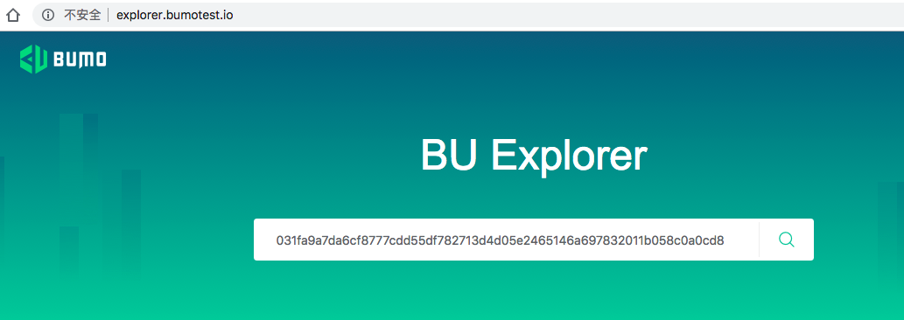
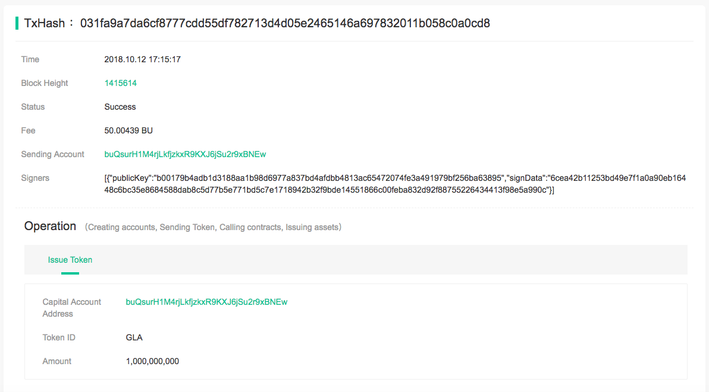

Developer Guide for Token Issuing
=======================================

Scenario Description
--------------------

The token issuer issues 1000000000 tokens on BuChain, the token code is GLA and the token name is Global. 
The specific information is as follows:

+-------------------------+----------+------------------+------------------------+
| Field Name              | Required | Example          | Description            |
+=========================+==========+==================+========================+
| name                    | yes      | Global           | Token name             |
+-------------------------+----------+------------------+------------------------+
| code                    | yes      | GLA              | Token code             |
+-------------------------+----------+------------------+------------------------+
| totalSupply             | yes      | 1000000000       | Total supply of tokens |
+-------------------------+----------+------------------+------------------------+
| decimals                | yes      | 8                | Token decimal          |
+-------------------------+----------+------------------+------------------------+
| description             | no       |                  | Token description      |
+-------------------------+----------+------------------+------------------------+
| icon                    | no       |                  | Token ICON             |
+-------------------------+----------+------------------+------------------------+   
| version                 | yes      | 1.0              | The version number of  |     
|                         |          |                  | the protocol           |
+-------------------------+----------+------------------+------------------------+

.. note:: - code: capitalized spell is recommended.

       - decimals: the number of decimal places which is in the range of 0~8, and 0 means no decimal place.

       - totalSupply: the total supply of the tokens which are in the range of 0~2^63-1, and 0 means no limitation for the tokens.
      
       - icon:  Base64 bit encoding, and the size of the icon file is less than 32k，200*200 pixels is recommended.

       - version: the version number of the protocol, and its present value is 1.0.
        

Development Process for Token Issuing
--------------------------------------

In this document we use the Java language as an example to create an token issuer and issue 1000000000 tokens.

.. note:: Please replace the [AccountAddressOfTokenIssuer] in the examples with the account address of the token to be issued by the token issuer.
       And replace the [AccountPrivateKeyOfTokenIssuer] in the examples with the account private key of the token to be issued by the token issuer.

Creating an SDK Instance
~~~~~~~~~~~~~~~~~~~~~~~~~

We create an instance with the following code and set its url (the IP and Port of the node).

::

 String url = "http://seed1.bumotest.io:26002";
 SDK sdk = SDK.getInstance(url);

In BuChain, the generation time for each block is 10 seconds, and only one confirmation is needed for a transaction to get the final state.

The environment description is as follows:

+-------------------------+--------------------+------------------+------------------------------+
| Network Environment     | IP                 | Port             | Blockchain Browser           |
+=========================+====================+==================+==============================+
| Main network            | seed1.bumo.io      | 16002            | https://explorer.bumo.io     |
+-------------------------+--------------------+------------------+------------------------------+
| Test network            | seed1.bumotest.io  | 26002            | http://explorer.bumotest.io  |
+-------------------------+--------------------+------------------+------------------------------+   

Creating an Account for the Token Issuer 
~~~~~~~~~~~~~~~~~~~~~~~~~~~~~~~~~~~~~~~~

The specific code for creating an account for the token issuer is as follows:

::

 public static AccountCreateResult createAccount() {
    AccountCreateResponse response = sdk.getAccountService().create();
    if (response.getErrorCode() != 0) {
        return null;
    }
    return response.getResult();
 }

The returned value is as follows:

::

 AccountCreateResult
     address:  buQYszjqVYdhcPT56GZcKHVh4i7xtx6amr2g
     privateKey:  privbUAYxPLLyaxvU3EMkSTfuEDTWxAYvyCasUcCgUxDihtNXQL4oHJx
     publicKey: b001724ed9475ca4c8893329924c7dceae66c61d8577ab2c2c3b29376e143137c20a4bbed176

.. note:: The account created above is not activated.

Activating the Account of Token Issuer 
~~~~~~~~~~~~~~~~~~~~~~~~~~~~~~~~~~~~~

The non-activated account needs to be activated by an activited account. Please skip this section if your issuer account is already activated.

.. note:: - Main network: you can activate the account by transfering 50.03 BU to the issuer account from the BuPocket(the Wallet). The BU can be used for the transaction fee of issuing tokens.

       - Test network: the token issuer can activate the account by sending an request to gavin@bumo.io, and the content of the request is the account address of the token.

Getting the Nonce Value 
~~~~~~~~~~~~~~~~~~~~~~~~

Each account maintains a nonce value which starts at 1. The nonce value represents the amount of transactions in the account.

The code used to get the nonce value is as follows:

::

 public long getAccountNonce() {
 long nonce = 0;

    // Init request
    String accountAddress = [AccountAddressOfTokenIssuer];
    AccountGetNonceRequest request = new AccountGetNonceRequest();
    request.setAddress(accountAddress);

    // Call getNonce
    AccountGetNonceResponse response = sdk.getAccountService().getNonce(request);
    if (0 == response.getErrorCode()) {
        nonce = response.getResult().getNonce();
    } else {
        System.out.println("error: " + response.getErrorDesc());
    }
   return nonce;
  }

The returned value is as follows:

::

 nonce: 28

Grouping Oprations for Token Issuing
~~~~~~~~~~~~~~~~~~~~~~~~~~~~~~~~~~~~~~

A transaction can consist of multiple operations, each pointing to a specific transaction content.
Two operations are needed to issue tokens: AssetIssueOperation, and AccountSetMetadataOperation.

The specific code for grouping operations for token issuing is as follows:

::

    public BaseOperation[] buildOperations() {
    // The account address to issue apt1.0 token
    String issuerAddress = [AccountAddressOfTokenIssuer];
    // The token name
    String name = "Global";
    // The token code
    String code = "GLA";
    // The apt token version
    String version = "1.0";
    // The apt token icon
    String icon = "";
    // The total supply number of tokens
    Long totalSupply = 1000000000L;
    // The present supply number of tokens
    Long nowSupply = 1000000000L;
    // The token description
    String description = "GLA TOKEN";
    // The token decimals
    Integer decimals = 0;

    // Build token issuance operation
    AssetIssueOperation assetIssueOperation = new AssetIssueOperation();
    assetIssueOperation.setSourceAddress(issuerAddress);
    assetIssueOperation.setCode(code);
    assetIssueOperation.setAmount(nowSupply);

    // If this is an atp 1.0 token, you must set metadata like this
    JSONObject atp10Json = new JSONObject();
    atp10Json.put("name", name);
    atp10Json.put("code", code);
    atp10Json.put("description", description);
    atp10Json.put("decimals", decimals);
    atp10Json.put("totalSupply", totalSupply);
    atp10Json.put("icon", icon);
    atp10Json.put("version", version);

    String key = "asset_property_" + code;
    String value = atp10Json.toJSONString();
    // Build setMetadata
    AccountSetMetadataOperation accountSetMetadataOperation = new AccountSetMetadataOperation();
    accountSetMetadataOperation.setSourceAddress(issuerAddress);
    accountSetMetadataOperation.setKey(key);
    accountSetMetadataOperation.setValue(value);

    BaseOperation[] operations = {assetIssueOperation, accountSetMetadataOperation};
    return operations;
    }

Serializing Transactions
~~~~~~~~~~~~~~~~~~~~~~~~~

Transactions are serialized for network transmission.

.. note:: - feeLimit: the maximum fee the transaction initiator will pay for the transaction, and please fill in 50.03 BU when the operation is issuing tokens.

       - nonce: the nonce value of this transaction initiator,  which can be obtained by adding 1 to the current nonce value.

The specific code for serializing transactions is as follows. 
In the example, **nonce** is the series number of account obtained by calling getAccountNonce, 
and **operations** is the operations for issuing tokens obtained by calling buildOperations.

::

 public String seralizeTransaction(Long nonce,  BaseOperation[] operations) {
 String transactionBlob = null;

 // The account address to issue atp1.0 token
 String senderAddresss =[AccountAddressOfTokenIssuer];
    // The gasPrice is fixed at 1000L, the unit is MO
    Long gasPrice = 1000L;
    // Set up the maximum cost 50.03BU
    Long feeLimit = ToBaseUnit.BU2MO("50.03");
   // Nonce should add 1
   nonce += 1;

 // Build transaction Blob
 TransactionBuildBlobRequest transactionBuildBlobRequest = new TransactionBuildBlobRequest();
 transactionBuildBlobRequest.setSourceAddress(senderAddresss);
 transactionBuildBlobRequest.setNonce(nonce);
 transactionBuildBlobRequest.setFeeLimit(feeLimit);
 transactionBuildBlobRequest.setGasPrice(gasPrice);
 for (int i = 0; i < operations.length; i++) {
    transactionBuildBlobRequest.addOperation(operations[i]);
 }
  TransactionBuildBlobResponse transactionBuildBlobResponse = sdk.getTransactionService().buildBlob(transactionBuildBlobRequest);
  if (transactionBuildBlobResponse.getErrorCode() == 0) {
 transactionBlob = transactionBuildBlobResponse. getResult().getTransactionBlob();
 } else {
    System.out.println("error: " + transactionBuildBlobResponse.getErrorDesc());
 }
 return transactionBlob;
 }

The returned value is as follows:

::

 transactionBlob: 
 0A2462755173757248314D34726A4C6B666A7A6B7852394B584A366A537532723978424E45771 
 01C18C0F1CED11220E8073A350802122462755173757248314D34726A4C6B666A7A6B7852394B 
 584A366A537532723978424E45772A0B0A03474C41108094EBDC033AB60108041224627551737 
 57248314D34726A4C6B666A7A6B7852394B584A366A537532723978424E45773A8B010A126173 
 7365745F70726F70657274795F474C4112757B22636F6465223A22474C41222C22746F74616C5 
 37570706C79223A313030303030303030302C22646563696D616C73223A302C226E616D65223A 
 22474C41222C2269636F6E223A22222C226465736372697074696F6E223A22474C412054 
  
  
Signing Transactions
~~~~~~~~~~~~~~~~~~~~

All transactions need to be signed to be valid. The signing result includes the signature data and the public key.

The specific code for signing transactions is as follows.
In the example, **transactionBlob** is the string of the seralized transactions obtained by calling seralizeTransaction.

::

 public Signature[] signTransaction(String transactionBlob) {
    Signature[] signatures = null;
    // The account private key to issue atp1.0 token
  String senderPrivateKey =[AccountPrivateKeyOfTokenIssuer];

 // Sign transaction BLob
 TransactionSignRequest transactionSignRequest = new TransactionSignRequest();
 transactionSignRequest.setBlob(transactionBlob);
 transactionSignRequest.addPrivateKey(senderPrivateKey);
 TransactionSignResponse transactionSignResponse = sdk.getTransactionService().sign(transactionSignRequest);
 if (transactionSignResponse.getErrorCode() == 0) {
    signatures = transactionSignResponse.getResult().getSignatures();
 } else {
    System.out.println("error: " + transactionSignResponse.getErrorDesc());
 }
 return signatures;
 }

The returned value is as follows:
::

 signData: 6CEA42B11253BD49E7F1A0A90EB16448C6BC35E8684588DAB8C5D77B5E771BD5C7E1718942B32 
 F9BDE14551866C00FEBA832D92F88755226434413F98E5A990C; 
 publicKey: b00179b4adb1d3188aa1b98d6977a837bd4afdbb4813ac65472074fe3a491979bf256ba63895

Sending Transactions
~~~~~~~~~~~~~~~~~~~~~

Sending transactions refers to sending the serialized transactions and the signatures to BuChain.

The specific code for sending transactions is as follows.
In the example, **transactionBlob** is the string of the seralized transactions obtained by calling seralizeTransaction,
and **signatures** is the signature data obtained by calling signTransaction.

::

 public String submitTransaction(String transactionBlob, Signature[] signatures) {
 String  hash = null;

 // Submit transaction
 TransactionSubmitRequest transactionSubmitRequest = new TransactionSubmitRequest();
 transactionSubmitRequest.setTransactionBlob(transactionBlob);
 transactionSubmitRequest.setSignatures(signatures);
 TransactionSubmitResponse transactionSubmitResponse = sdk.getTransactionService().submit(transactionSubmitRequest);
 if (0 == transactionSubmitResponse.getErrorCode()) {
        hash = transactionSubmitResponse.getResult().getHash();
 } else {
        System.out.println("error: " + transactionSubmitResponse.getErrorDesc());
  }
 return  hash ;
 }

The returned value is as follows:

::

 hash:  031fa9a7da6cf8777cdd55df782713d4d05e2465146a697832011b058c0a0cd8

Checking the Result of the Transaction Execution
~~~~~~~~~~~~~~~~~~~~~~~~~~~~~~~~~~~~~~~~~~~~~~~~

.. note:: The returned result of transactions sent represents whether the transaction is submitted successfully.
       To check whether the transaction is executed successfully, you have to perform one of the two operations:

Querying from the Blockchain Browser
^^^^^^^^^^^^^^^^^^^^^^^^^^^^^^^^^^^^^^^^^^^

You can query the result from the BUMO Blockchain browser by the hash value you obtained above. The address of the main network is `<https://explorer.bumo.io>`_ and the address of the test network is  `<http://explorer.bumotest.io>`_：

|BUBrowser|

The result returned is as follows:

|execution_result_of_transaction|

Querying by Calling the Interface
^^^^^^^^^^^^^^^^^^^^^^^^^^^^^^^^^^

The specific code to call the interface is as follows.
In the example, **txHash** is the hash value of transactions which is the unique identification obtained by calling submitTransaction.

::

 public boolean checkTransactionStatus(String txHash) {
    Boolean transactionStatus = false;

 // Wait for 10 seconds for the execution of the transaction
 try {
    Thread.sleep(10000);
 } catch (InterruptedException e) {
    e.printStackTrace();
 }
 // Init request
 TransactionGetInfoRequest request = new TransactionGetInfoRequest();
 request.setHash(txHash);

 // Call getInfo
 TransactionGetInfoResponse response = sdk.getTransactionService().getInfo(request);
 if (response.getErrorCode() == 0) {
    transactionStatus = true;
 } else {
    System.out.println("error: " + response.getErrorDesc());
  }
 return transactionStatus;
 }

The returned value is as follows:

::
 
 transactionStatus: true

